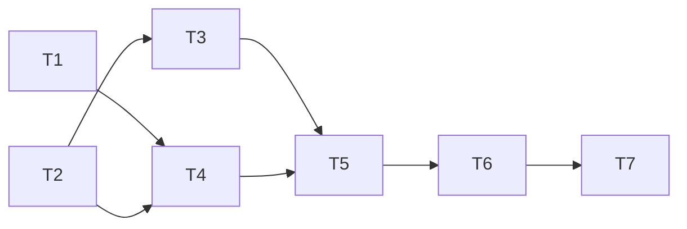

# Reservation Cancellation Implementation Tasks

Status: Approved for implementation.

Each task is one safe commit in the named repository. T1–T6 belong to
`rent-flow-reservation`; T7 belongs to `rent-flow-common`. The specification self-evaluation is a
local verification artifact and is not included in either repository's implementation commits.

The dependency graph is:

## T1 — Configure the Kafka producer and source topic

**State:** Pending.

**Repository:** `rent-flow-reservation`.

**Commit:** `build: configure reservation cancellation kafka producer`

**Depends on:** None.

**Refs.** requirements.md AC3.3, AC3.6, AC4.1; design.md §5.3, §7, §8.3.

**Scope.**

- Add Spring Kafka plus the Kafka Testcontainers support needed by later relay integration tests.
- Add validated cancellation Kafka properties and `ReservationKafkaConfig` using byte-array key
  and value serializers.
- Configure `acks=all`, producer idempotence, bounded producer timeouts, and the remaining producer
  defaults from design.md §5.3.
- Declare the three-partition source `NewTopic` only under the `local` profile; keep production
  provisioning external and broker automatic topic creation disabled.
- Keep Kafka out of readiness and keep producer/admin initialization lazy enough that a broker
  outage does not prevent the application from serving database-backed requests.

**DoD.**

- Configuration tests prove the producer uses byte arrays, `acks=all`, idempotence, five maximum
  in-flight requests, and the specified request, delivery, and block timeouts.
- Property-validation tests reject missing/invalid topic, timeout, and producer settings before
  relay startup.
- Local-profile tests prove the source topic bean requests three partitions, replication factor
  one, delete cleanup, and seven-day retention; non-local tests prove no source-topic bean exists.
- Health/configuration tests prove readiness remains `readinessState,db` and application startup
  does not require a reachable Kafka broker.
- No production setting enables broker automatic topic creation or application-owned production
  topic provisioning.
- `mvn -B -ntp clean verify` reports `BUILD SUCCESS`.

## T2 — Add the immutable cancellation outbox

**State:** Pending.

**Repository:** `rent-flow-reservation`.

**Commit:** `feat: add reservation cancellation outbox`

**Depends on:** None.

**Refs.** requirements.md AC2.1–AC2.6, AC3.2, AC3.4–AC3.5, AC4.4; design.md §4,
§11.2.

**Scope.**

- Add append-only `V3__reservation_cancellation_outbox.sql` in the Reservation-owned schema,
  leaving V1 and V2 unchanged.
- Add `ReservationCancellationOutbox` with immutable event data and only the delivery-state
  transitions defined in design.md §4.3.
- Add narrowly scoped repository operations for PostgreSQL time, the advisory relay lock, oldest
  FIFO row selection, backlog statistics, and bounded published-row cleanup.
- Add the pessimistic `findForUpdateById` operation to `ReservationRepository`.

**DoD.**

- Migration tests prove V3 creates exactly the nine specified columns, the primary key, every
  JSON/key/size/delivery-state constraint, and the two partial indexes in `reservation` only.
- Database tests reject invalid record keys, non-object/duplicate-key/oversized JSON, negative
  attempts, inconsistent published/next-attempt state, partial failure metadata, and invalid
  timestamp ordering.
- Mapping tests prove event ID, record key, payload, and occurrence time are non-updatable and
  there is no reservation foreign key, topic, claim, lease, stack trace, or arbitrary error text.
- Repository integration tests prove PostgreSQL UTC time, transaction advisory-lock exclusion,
  globally oldest unpublished selection, pending statistics, and skip-locked cleanup selection.
- Entity tests prove successful and failed attempts update only the mutable delivery metadata and
  preserve the exact persisted event ID, key, payload, and occurrence time.
- `mvn -B -ntp clean verify` reports `BUILD SUCCESS`.

## T3 — Implement the atomic cancellation command

**State:** Pending.

**Repository:** `rent-flow-reservation`.

**Commit:** `feat: persist reservation cancellation events`

**Depends on:** T2.

**Refs.** requirements.md AC1.2–AC1.3, AC1.6–AC1.7, AC2.1, AC2.3–AC2.7,
AC3.6, AC4.3–AC4.5; design.md §1.3, §2–§4, §9, §11.1–§11.2.

**Scope.**

- Add `ReservationCancellationService` as the single transactional owner of reservation-row
  locking, state transition, version-1 event construction, one-time serialization, and outbox
  insertion.
- Generate one UUID v4 and one PostgreSQL `clock_timestamp()` per eligible transition; persist the
  exact compact JSON and exact case-sensitive serial-number key.
- Treat current `CANCELLED` state as an idempotent no-op and use the existing not-found exception
  for a missing reservation.
- Keep the public cancel route unexposed until the relay is operational in T4; do not change the
  existing PUT or DELETE paths.

**DoD.**

- Unit tests prove both `HELD` and `CONFIRMED` become `CANCELLED`, while an already `CANCELLED`
  reservation is unchanged without sampling time or writing an outbox row.
- Contract tests prove the persisted value is compact UTF-8 JSON with exactly the five fields in
  the specified order, the required constant/type formats, escaping, no `reservationId`, and a
  maximum size of 4096 bytes.
- Integration tests prove an eligible transition and exactly one outbox row commit atomically with
  one database-sourced occurrence/initial-attempt time.
- Missing-reservation and forced serialization/persistence/commit-failure tests prove no partial
  reservation or outbox write survives.
- A real PostgreSQL concurrency test proves simultaneous cancellations serialize on the row lock
  and commit one transition and one logical event; a rolled-back winner permits a waiter to create
  that event.
- Tests prove the command makes no Kafka or Inventory call and that legacy PUT/DELETE behavior
  remains unchanged and creates no cancellation outbox record.
- Controller/OpenAPI assertions prove the cancel route is still absent in this intermediate
  commit.
- `mvn -B -ntp clean verify` reports `BUILD SUCCESS`.

## T4 — Relay outbox events with durable FIFO retry

**State:** Pending.

**Repository:** `rent-flow-reservation`.

**Commit:** `feat: relay reservation cancellations to kafka`

**Depends on:** T1, T2.

**Refs.** requirements.md AC3.1–AC3.7, AC4.1–AC4.4; design.md §3.2, §5, §7,
§8, §9, §11.1–§11.3.

**Scope.**

- Add `ReservationCancellationOutboxRelayService` with one `REQUIRES_NEW` transaction, advisory
  lock, oldest-row lock, synchronous bounded broker acknowledgement, and one event attempt.
- Add `ReservationCancellationOutboxRelayScheduledService` with a one-second fixed delay, a
  100-event limit, and a five-second drain budget.
- Add indefinite persisted exponential backoff with bounded failure codes, a five-minute nominal
  cap, 20-percent jitter, overflow saturation, and strict global FIFO blocking.
- Publish only the persisted UTF-8 key/value through `KafkaTemplate<byte[], byte[]>`, with no
  application headers or reserialization.
- Add bounded relay metrics and payload-free failure/recovery logging while leaving Kafka outside
  readiness.

**DoD.**

- Unit tests cover every scheduler stop condition: empty queue, ineligible oldest row, busy lock,
  failure, 100 successes, and five-second budget; production defaults assert the one-second fixed
  delay.
- Backoff tests cover failed-attempt numbering, 1-second-to-5-minute nominal exponential growth,
  0.8–1.2 jitter, numeric saturation, persisted eligibility, and unlimited retries without
  sleeping.
- PostgreSQL tests prove only one instance can publish at a time, the globally oldest row is
  selected, an ineligible/failed oldest row blocks later rows, and transaction/row locks are
  released on every result.
- Kafka 4.3.1 Testcontainers tests with auto-creation disabled prove three-partition topic policy,
  exact persisted key/value bytes, no Java type headers, stable same-key partition/order, and no
  publish-before-commit behavior.
- Success tests prove an outbox row is marked published only after broker acknowledgement; timeout,
  interruption, send failure, and database-commit ambiguity tests leave it retryable with the
  same event ID/key/value and restore interrupt status where applicable.
- Outage tests prove cancellation transactions continue to commit locally while Kafka is absent;
  tests and documentation describe the intentional at-least-once duplicate windows without an
  exactly-once claim.
- Metrics have only the specified bounded labels, gauges use PostgreSQL-derived backlog data, and
  logs contain no serial number, record key, payload, exception message, or stack trace.
- `mvn -B -ntp clean verify` reports `BUILD SUCCESS`.

## T5 — Expose the cancellation HTTP contract

**State:** Pending.

**Repository:** `rent-flow-reservation`.

**Commit:** `feat: expose reservation cancellation endpoint`

**Depends on:** T3, T4.

**Refs.** requirements.md AC1.1–AC1.7, AC2.7, AC3.6, AC4.3, AC4.5; design.md §2,
§9, §11.4.

**Scope.**

- Add `POST /api/v1/reservations/{id}/cancel` to `ReservationController`, delegating only to the
  completed cancellation service and returning an empty `204`.
- Document operation ID `cancelReservation`, no request representation or required
  `Idempotency-Key`, existing Problem Details failures, and the eventual-consistency boundary.
- Add HTTP integration, OpenAPI, and regression coverage without changing existing PUT/DELETE
  behavior.

**DoD.**

- HTTP tests prove eligible `HELD` and `CONFIRMED` reservations return an empty `204` only after the
  atomic transition/outbox transaction commits.
- Repeated and concurrent HTTP calls prove every successful observer receives empty `204` while
  exactly one transition and one outbox event exist.
- Tests prove an already-cancelled reservation returns empty `204` with no event, a missing UUID
  returns `404 RESERVATION_NOT_FOUND`, and a malformed UUID returns `400 VALIDATION_FAILED`, with no
  writes in either failure case.
- Contract tests prove an empty request without `Content-Type` or `Idempotency-Key` is accepted and
  no replay/expiry headers are emitted.
- Forced local-transaction failure returns the existing safe `500 INTERNAL_ERROR` and leaves both
  tables unchanged.
- Tests prove the HTTP request neither invokes Kafka/Inventory nor waits for publication or
  Inventory consumption, including while Kafka is unavailable.
- OpenAPI tests prove the exact method/path, operation ID, empty `204`, error responses, and text
  explaining that `204` reports only the local Reservation outcome.
- Existing PUT/DELETE request, response, validation, persistence, and no-event behavior remain
  covered and unchanged.
- `mvn -B -ntp clean verify` reports `BUILD SUCCESS`.

## T6 — Add retention cleanup and the operating runbook

**State:** Pending.

**Repository:** `rent-flow-reservation`.

**Commit:** `feat: operate reservation cancellation outbox`

**Depends on:** T5.

**Refs.** requirements.md AC3.5–AC3.7, AC4.6; design.md §6, §8, §10, §11.2,
§11.4.

**Scope.**

- Add the cleanup service and scheduled wrapper using the existing bounded-cleanup project
  pattern: daily at 03:30 UTC, 1000 rows per chunk, and a 60-second runtime budget.
- Add cleanup metrics and bounded failure logging.
- Update the Reservation README with the endpoint, exact event/topic contract, outbox/inbox
  boundary, at-least-once/FIFO behavior, retries, health, retention, telemetry, alert guidance, and
  guarded manual recovery procedure.

**DoD.**

- PostgreSQL tests prove cleanup deletes only broker-acknowledged rows whose `published_at` is at
  least 30 days old, in ordered skip-locked chunks no larger than 1000.
- Scheduler/service tests prove `REQUIRES_NEW` chunks, the 03:30 UTC default, the 60-second budget,
  safe concurrent instances, continuation across full chunks, and retry on the next schedule after
  failure without blind sleeps.
- Tests prove unpublished rows are retained indefinitely and published rows are never
  automatically republished because Inventory lagged or the source record expired.
- Cleanup counters/timer/backlog gauge and warnings follow design.md §8 and expose no identifiers,
  payloads, exception messages, stack traces, or high-cardinality labels.
- README documents the HTTP/event contracts and eventual consistency, distinguishes Kafka
  producer idempotence from end-to-end exactly once, and states the seven-day topic versus 30-day
  acknowledged-outbox retention windows.
- The runbook requires Inventory state/inbox investigation before replaying the retained exact
  key/value and warns about version 1's stale-first-delivery limitation; it adds no administrative
  replay endpoint or automatic reconciliation.
- `mvn -B -ntp clean verify` reports `BUILD SUCCESS`.

## T7 — Wire the common stack and verify the end-to-end flow

**State:** Pending.

**Repository:** `rent-flow-common`.

**Commit:** `feat: wire reservation cancellation through kafka`

**Depends on:** T6 and Inventory's implemented cancellation consumer.

**Refs.** requirements.md AC1.1–AC1.2, AC2.1, AC3.1–AC3.2, AC3.6–AC3.7,
AC4.1–AC4.6; design.md §7.2, §9, §11.3–§11.4.

**Scope.**

- Add `KAFKA_BOOTSTRAP_SERVERS=rentflow-kafka:19092` and the `local` Spring profile to Reservation
  in common Compose, and make it depend on healthy PostgreSQL, Kafka, and its existing service
  prerequisites.
- Extend common database bootstrap assertions to cover the platform-provisioned `reservation`
  login role/schema without granting cross-schema ownership.
- Build/start/health-check the Reservation runtime image in the combined smoke test.
- Replace the smoke test's direct cancellation-event injection with Reservation creation followed
  by `POST /api/v1/reservations/{id}/cancel`; keep the Inventory state/history and duplicate-effect
  assertions so the test covers the actual outbox producer and implemented consumer.
- Complete cross-repository regression and specification verification; generate the spec
  self-evaluation report locally but do not include it in an implementation commit.

**DoD.**

- `docker compose config --quiet` proves Reservation receives the internal Kafka address and local
  profile, and waits for healthy required dependencies without changing production readiness.
- The common smoke test proves Reservation owns creation of the three-partition source topic with
  delete cleanup and seven-day retention; the script no longer pre-creates that topic or injects a
  handcrafted cancellation record for the happy path.
- The automated flow creates an Inventory item and Reservation through public APIs, cancels it
  through the new endpoint, waits deterministically for Inventory to become `AVAILABLE`, and
  verifies the `RESERVED`-to-`AVAILABLE` history entry.
- After reserving the item again, repeating cancellation on the already `CANCELLED` reservation
  produces no new Inventory release/history effect, proving the HTTP no-op does not create another
  logical event.
- Stack restart assertions prove database and Kafka persistence, and liveness/readiness assertions
  include Reservation while retaining Kafka-independent production readiness semantics.
- In `rent-flow-common`, `./scripts/container-smoke-test.sh` reports
  `Combined container smoke verification passed`.
- In `rent-flow-reservation`, `git diff --check` reports no whitespace errors and
  `mvn -B -ntp clean verify` reports `BUILD SUCCESS` without skipped checks.
- Every acceptance criterion is mapped below to a task with a regression or verification step that
  would fail if its observable behavior changed.
- The final spec self-evaluation has no `FAIL` item; its timestamped report remains an uncommitted
  local validation artifact as requested.

## Acceptance-criteria task traceability

| Requirement | Implementation and verification task |
| --- | --- |
| AC1.1 | T3, T5, T7 |
| AC1.2 | T3, T5, T7 |
| AC1.3–AC1.5 | T3, T5 |
| AC1.6–AC1.7 | T3, T5 |
| AC2.1 | T2, T3, T7 |
| AC2.2 | T2 |
| AC2.3–AC2.6 | T2, T3 |
| AC2.7 | T3, T5 |
| AC3.1–AC3.2 | T2, T4, T7 |
| AC3.3 | T1, T4 |
| AC3.4–AC3.5 | T2, T4, T6 |
| AC3.6–AC3.7 | T1, T3–T5, T7 |
| AC4.1 | T1, T4, T7 |
| AC4.2 | T4, T7 |
| AC4.3 | T3, T5, T7 |
| AC4.4 | T2–T4, T7 |
| AC4.5 | T3, T5 |
| AC4.6 | T6, T7 |
