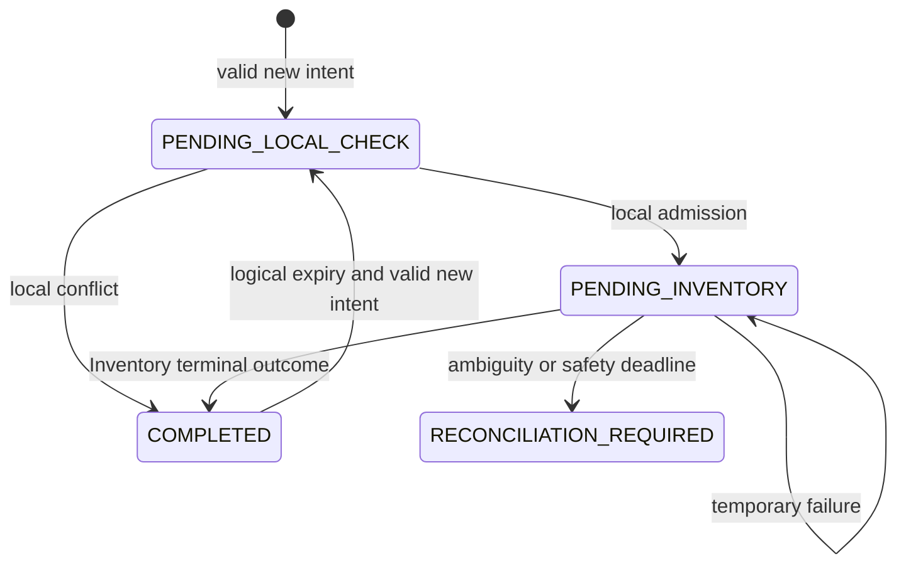

# Reservation Creation Design

Status: Design and implementation tasks drafted.

This document implements `requirements.md`. Numbered sections are stable traceability targets.
The Service Skeleton remains authoritative wherever this feature does not explicitly supersede it.

## 1. Scope and architecture

### 1.1 Design boundary

This feature owns `POST /api/v1/reservations` from request binding through local availability,
Inventory acquisition, durable recovery, local persistence, and response replay. It supersedes
the Service Skeleton design §2.1–§2.2, §3.1, and §4.1 only where those sections define the
single-reservation creation request, historical-date acceptance, unconditional creation,
`Location`, or creation documentation.

The Service Skeleton remains authoritative for the Reservation entity and table, retrieval,
listing, replacement, deletion, generic RFC 9457 handling, schema isolation, health, container,
and build foundations. The existing `PUT /api/v1/reservations/{id}` behavior is deliberately not
changed. Consequently, the one-active-reservation concurrency guarantee in this feature applies
to creation intents competing through POST; replacement remains capable of changing serial,
period, and status without the new creation workflow (requirements Out of scope and Resolved
question 9).

The upstream contract is the sibling
[Inventory Status Transition design](../../../rent-flow-inventory/.specs/inventory-status-transition/design.md),
especially §2.1, §3.1, §3.3, §5, and §9. Reservation never accesses the `inventory` schema.

### 1.2 Resolved design decisions

| Concern | Decision |
| --- | --- |
| Creation representation | One envelope contains common `customerId`/`orderId` and 1–100 item objects. |
| Success | `201 Created`, direct response array in request order, no `Location`. |
| Local activity | `HELD` or `CONFIRMED` with inclusive `endDate >= acceptedDate`; period overlap is irrelevant. |
| Time authority | PostgreSQL supplies the accepted UTC date, Reservation creation timestamps, and every persisted workflow time boundary; no service-instance wall clock participates in those decisions. |
| Final claim | One atomic Inventory batch transitions every serial to `RESERVED`; exact `204` is success. |
| Cross-service consistency | A durable local workflow surrounds the remote call; no distributed transaction or blind compensation. |
| Execution coordination | Database-backed 30-second leases; no database transaction remains open during HTTP latency. |
| Foreground resilience | Pricing's Inventory client, retry, circuit-breaker, and timeout defaults are reused. |
| Recovery | Scan every 30 seconds, process at most 100 due intents, and reuse the same key and payload. |
| Safety horizon | Stop automatic Inventory calls at a conservative seven-day deadline and require manual reconciliation. |
| Terminal replay | Store the complete local outcome for exactly seven days from database-recorded completion. |

### 1.3 Components and request flow

Use existing packages and extend the current layers rather than introduce a new architectural
layer:

| Package | Types | Responsibility |
| --- | --- | --- |
| `com.rentflow.controller` | `ReservationController`, `ApiExceptionHandler` | Bind the batch, validate the header, map outcomes to HTTP |
| `com.rentflow.dto` | `CreateReservationsRequest`, `CreateReservationItemRequest`, `ReservationCreationProblemResponse`, `ReservationCreationFailureDTO` | Public request and failure representations |
| `com.rentflow.converter` | `ReservationConverter` | Map request items and stored outcome snapshots to API representations |
| `com.rentflow.service` | `ReservationCreationService`, `ReservationCreationStoreService`, `ReservationCreationRecoveryService`, `ReservationCreationRecoveryScheduledService`, `DatabaseTimeProvider`, `InventoryGateway`, fingerprint and exceptions | Orchestrate short local transactions, database time, the remote claim, replay, and recovery |
| `com.rentflow.service.rest` | `RestInventoryService`, `InventoryHttpClient`, `InventoryRetryableExceptionPredicate` | Implement and protect the Inventory HTTP call |
| `com.rentflow.repository` | `ReservationRepository`, `ReservationCreationRequestRepository` | Query active reservations and persist/lease workflow rows |
| `com.rentflow.model` | `ReservationCreationRequest`, `ReservationCreationState`, command/item/outcome/failure records | Persist workflow state without depending on DTOs |
| `com.rentflow.config` | `InventoryHttpClientConfig` | Import and configure the named Inventory client |

The normal new-intent flow is:

```text
POST JSON + Idempotency-Key
  -> stable request validation and canonical command
  -> short transaction: sample PostgreSQL time, register PENDING_LOCAL_CHECK, and acquire lease
  -> short transaction: query active reservations
       conflict -> store terminal 409
       clear    -> advance to PENDING_INVENTORY
  -> InventoryGateway (no local transaction)
       CircuitBreaker("inventory")
         -> Retry("inventory")
           -> PATCH /api/v1/inventory/status
  -> short transaction: recheck local activity, save all reservations with DB timestamps,
                        and store terminal 201 outcome
  -> response array
```

A replay returns the stored outcome before local availability or Inventory evaluation. An
unfinished row is resumed at its stored phase by either the caller or the recovery scheduler.

## 2. HTTP creation contract

### 2.1 Request and stable validation

`POST /api/v1/reservations` continues to consume `application/json`, but its body becomes
`CreateReservationsRequest`:

```json
{
  "customerId": "CUSTOMER-001",
  "orderId": "ORDER-001",
  "items": [
    {"serialNumber": "DRILL-001", "startDate": "2026-10-01", "endDate": "2026-10-03"},
    {"serialNumber": "MIXER-001", "startDate": "2026-10-01", "endDate": "2026-10-01"}
  ]
}
```

`CreateReservationsRequest` has `@NotBlank @Size(max = 64)` common identifiers and
`@NotNull @Size(min = 1, max = 100)` on
`List<@NotNull @Valid CreateReservationItemRequest> items`. Each item has a non-null String
`serialNumber` and non-null strict ISO `LocalDate` values. Reservation deliberately applies no
serial pattern, blank, or length constraint: Inventory owns serial-number validity (AC1.4,
AC3.7). Existing Jackson scalar-to-string conversion remains active; validation applies to the
resulting String.

Controller validation rejects duplicate non-null serial strings case-sensitively and reports each
subsequent occurrence as `items[i].serialNumber`. Stable date validation rejects years outside
0001–9999 and `endDate < startDate`. Unknown properties, malformed JSON, nulls, array shape, and
deserialization errors use the existing validation/malformed-JSON behavior. All stable validation
finishes before workflow lookup or persistence.

Do not use `@FutureOrPresent`: it would reject a legitimate retry after midnight before the
idempotency record can be consulted. The dynamic `startDate >= acceptedDate` rule runs only when
the workflow store determines that the key represents a new or logically expired intent (§3.1).

### 2.2 Idempotency header and request identity

The controller enumerates `HttpServletRequest.getHeaders("Idempotency-Key")`, matching Inventory's
handling. Exactly one value must match the canonical UUID v4 expression
`[0-9a-fA-F]{8}-[0-9a-fA-F]{4}-4[0-9a-fA-F]{3}-[89aAbB][0-9a-fA-F]{3}-[0-9a-fA-F]{12}`.
Either hex case is accepted and `UUID.fromString` normalizes it. Missing, repeated, malformed, or
non-v4 values produce `400 VALIDATION_FAILED` before a workflow row or Inventory request.

Keys are global to Reservation's creation endpoint. The fingerprint includes the complete
validated command in array order; §4.3 defines its canonical form. A key mismatch is decided
before dynamic new-intent date validation so a caller cannot reuse an unexpired key by submitting
a now-invalid alternative body.

### 2.3 Successful response

After the final local transaction commits, return:

- `201 Created`;
- `Content-Type: application/json`;
- a direct array of `ReservationDTO` objects in input order;
- `Idempotency-Replayed: false` for first delivery or `true` for replay; and
- `Idempotency-Key-Expires-At` containing the local terminal replay expiry.

Do not emit `Location`: no single created reservation is the canonical target of the batch. Each
element contains the existing eight response fields. The batch's common identifiers are repeated
in each created representation because the response is a list of reservation resources.

### 2.4 Result matrix

| Condition | Response | Durable workflow result |
| --- | --- | --- |
| Complete success | `201` array | `COMPLETED`, response snapshot |
| Stable input or key validation fails | `400` existing problem | No new row |
| New/expired intent starts in the past | `400 VALIDATION_FAILED` | No new workflow is recorded; an old row remains logically expired |
| Active local reservations | `409 ACTIVE_RESERVATION_EXISTS` | `COMPLETED`, problem snapshot |
| Inventory says all failures are missing | `422 INVENTORY_ITEM_NOT_FOUND` | `COMPLETED`, problem snapshot |
| Inventory lifecycle conflict | `409 INVENTORY_ITEM_UNAVAILABLE` | `COMPLETED`, problem snapshot |
| Inventory invalid serial | `400 INVALID_INVENTORY_REFERENCE` | `COMPLETED`, problem snapshot |
| Local or upstream key is busy | `409 IDEMPOTENCY_IN_PROGRESS`, `Retry-After: 1` | Remains pending |
| Local unexpired key reused with another payload | `422 IDEMPOTENCY_KEY_REUSED` | Original row unchanged |
| Inventory reports key reuse for a locally new workflow | `422 IDEMPOTENCY_KEY_REUSED` | `COMPLETED`, problem snapshot |
| Inventory protocol surprise | `502 INVENTORY_SERVICE_ERROR` | `RECONCILIATION_REQUIRED` when mutation may be ambiguous |
| Inventory unavailable/circuit open | `503 INVENTORY_SERVICE_UNAVAILABLE` | Remains pending and due for recovery |
| Safe recovery deadline reached | `503 CREATION_RECONCILIATION_REQUIRED` | `RECONCILIATION_REQUIRED` |
| Unexpected local failure | Sanitized `500 INTERNAL_ERROR` | Current transaction rolls back; prior pending row remains |

Generic `406`, `415`, method, routing, and sanitized `500` behavior remains defined by the Service
Skeleton. Terminal stored outcomes carry the two idempotency response headers. Busy, mismatch,
unfinished `503`, and reconciliation responses do not pretend to be terminal replays and do not
carry a terminal expiry header.

## 3. Creation orchestration

### 3.1 Decision order and accepted date

`ReservationCreationService.create` uses this order:

1. Receive a structurally valid canonical `ReservationCreationCommand` and canonical UUID key.
2. Compute the fingerprint.
3. In a short store transaction, obtain one PostgreSQL time snapshot and lock or register the key.
4. Treat a logically expired `COMPLETED` row as absent; physical cleanup timing never extends its
   replay semantics.
5. For every remaining existing row, compare the fingerprint first and reject a mismatch without
   changing its state.
6. For an unexpired `COMPLETED` row, replay its stored outcome.
7. For `RECONCILIATION_REQUIRED`, return its safe stored problem without automatic work.
8. For a pending row, acquire an available lease; do not revalidate
   the command against the newer calendar date.
9. For a missing or logically expired row, derive `acceptedDate` from the snapshot's explicitly
   converted UTC date and validate every `startDate >= acceptedDate`; on success, create
   `PENDING_LOCAL_CHECK` with the command, accepted date, recovery deadline, and lease.
10. Execute the stored phase as described in §3.2, §5, and §6.
11. Return only an outcome committed by a short store/finalization transaction, or a temporary
   problem describing unfinished work.

The persisted `acceptedDate` makes all date-dependent decisions for one intent deterministic. Its
source is the same PostgreSQL time authority used to decide logical workflow expiry during the
registration transaction, and its UTC conversion does not depend on the connection's session
timezone. Resume and replay never turn a once-valid command into a historical-date validation
failure (AC4.9).

### 3.2 Local active-reservation evaluation

For `PENDING_LOCAL_CHECK`, query `reservation.reservations` for the request's distinct serials
using:

```sql
status IN ('HELD', 'CONFIRMED') AND end_date >= :acceptedDate
```

String equality remains case-sensitive. Start dates and overlap with the requested period are not
part of the predicate. Convert the query result to a set, then walk command items in request order
to build one `ACTIVE_RESERVATION_EXISTS` failure per conflicting requested serial. If any exist,
atomically store the request-ordered `409` outcome and complete the workflow without Inventory.

If none exist, advance the phase to `PENDING_INVENTORY` before releasing the transaction. This
phase transition is the durable statement that local admission succeeded and Inventory may have
been or may later be contacted. Recovery never moves that phase backward.

After Inventory returns exact `204`, the finalization transaction repeats the same active query
with the stored `acceptedDate` before inserting. This detects a local active row introduced while
the remote call was in flight. If detected after Inventory success, do not create a second active
reservation or release Inventory blindly; move the workflow to `RECONCILIATION_REQUIRED` and emit
the safe `503` problem from §7.

### 3.3 Concurrent claims and unchanged replacement

Two new POST intents may both pass the preliminary local query. Inventory is the final creation
claim authority: its sorted item locks serialize the two `AVAILABLE -> RESERVED` batches, so at
most one can return terminal `204`. The losing complete batch becomes `409
INVENTORY_ITEM_UNAVAILABLE`. This closes the creation check-then-act race without holding local
row locks during HTTP.

V2 adds a partial lookup index but no uniqueness constraint. A partial unique index cannot encode
the moving `endDate >= current date` boundary, and a uniqueness constraint covering every
`HELD`/`CONFIRMED` row would incorrectly block an item because of outdated history. Creation
concurrency is therefore enforced by Inventory and verified by the final local check.

`PUT` remains outside this workflow by explicit decision. It does not acquire creation leases,
consult Inventory, or enforce the active predicate. The final POST check catches a replacement
that commits before it, but this feature does not claim serialization against a replacement that
races and commits afterward. Closing that separate mutation path requires a future status and
replacement specification.

### 3.4 Transaction boundaries

`ReservationCreationService` has no method-wide `@Transactional`. It calls
`ReservationCreationStoreService` methods that use short transactions for registration/lease,
local admission, phase changes, finalization, retry scheduling, and terminal cleanup. The
Inventory HTTP call and retry wait occur after the phase transaction commits and before the
finalization transaction begins; no connection or database lock is retained for remote latency.

The successful finalization transaction performs the second local check, `saveAllAndFlush` for
every new Reservation, builds the persisted response snapshot from the flushed entities, and
saves and flushes the `COMPLETED` workflow row. Failure of any insert, snapshot serialization, flush,
or commit rolls back every local reservation and the terminal outcome together. The already
committed `PENDING_INVENTORY` row remains available after its lease expires, allowing the same
Inventory key to recover the uncertain remote step.

There is no XA/two-phase commit. Cross-service consistency comes from durable phase state,
Inventory's idempotent replay, local atomic finalization, and bounded recovery.

## 4. Persistence design

### 4.1 Append-only V2 migration

Add `src/main/resources/db/migration/V2__reservation_creation_workflow.sql`. It changes only the
Reservation-owned schema and performs:

1. a PostgreSQL `CURRENT_TIMESTAMP` default for the existing `reservations.created_at` column;
2. `reservation.reservation_creation_requests`; and
3. `idx_reservations_creation_active_lookup` on
   `(serial_number, end_date)` with static predicate `status IN ('HELD', 'CONFIRMED')`.

The workflow table contains:

| Column | PostgreSQL | Rule |
| --- | --- | --- |
| `idempotency_key` | `uuid` PK | Endpoint-global key |
| `fingerprint` | `varchar(64)` | Lowercase SHA-256 hex |
| `request_payload` | `jsonb` | Canonical validated command, JSON object |
| `accepted_date` | `date` | UTC date derived from the same PostgreSQL snapshot as `recorded_at` |
| `state` | `varchar(32)` | `PENDING_LOCAL_CHECK`, `PENDING_INVENTORY`, `COMPLETED`, `RECONCILIATION_REQUIRED` |
| `outcome` | `jsonb` nullable | Present for completed/reconciliation responses |
| `terminal_http_status` | `smallint` nullable | `201`, `400`, `409`, or `422` only for `COMPLETED` |
| `lease_owner` | `uuid` nullable | Opaque per-execution token |
| `lease_expires_at` | `timestamptz` nullable | Database-time lease boundary |
| `next_attempt_at` | `timestamptz` | Earliest automatic retry time |
| `attempt_count` | `integer` | Nonnegative logical Inventory executions |
| `recorded_at` | `timestamptz` | Database-recorded creation time |
| `updated_at` | `timestamptz` | Database-recorded last state change |
| `recovery_deadline` | `timestamptz` | Exactly `recorded_at + 168 hours` |
| `completed_at` | `timestamptz` nullable | Database time for terminal completion |
| `expires_at` | `timestamptz` nullable | Exactly `completed_at + 168 hours` |

CHECK constraints enforce state-dependent nullability, valid state/status values, nonnegative
attempt count, lowercase fingerprint shape, JSON object shape, recovery-deadline arithmetic, and
terminal-expiry arithmetic. Completed rows have no lease. Pending rows have no terminal outcome.
Reconciliation rows retain an outcome and never receive terminal expiry.

Add recovery index `(state, next_attempt_at, lease_expires_at, idempotency_key)` and cleanup index
`(expires_at, idempotency_key) WHERE state = 'COMPLETED'`. Do not modify V1.

Map `Reservation.timestamp` with `insertable = false`, `updatable = false`, and Hibernate
`@Generated(event = EventType.INSERT)`, then remove its `Instant.now()` assignment from
`@PrePersist`. The V2 default supplies the existing `timestamptz(6)` column value, and the generated
mapping makes `saveAllAndFlush` retrieve every timestamp before the success snapshot is built.
This applies the same PostgreSQL authority to every newly inserted Reservation while leaving
replacement semantics and existing rows unchanged.

### 4.2 Entity and state transitions

`ReservationCreationRequest` is the JPA entity for the workflow table. Hibernate JSON mapping
uses `@JdbcTypeCode(SqlTypes.JSON)` for the command and outcome model records. Mutator methods
enforce transitions rather than exposing general setters.



No automatic transition leaves `RECONCILIATION_REQUIRED`. Physical cleanup deletes only
logically expired `COMPLETED` rows. A logically expired completed row can be replaced under its row
lock before cleanup reaches it.

### 4.3 Fingerprint and snapshots

`IdempotencyFingerprint` computes SHA-256 over a versioned, length-prefixed UTF-8 sequence in this
order: version, `customerId`, `orderId`, item count, then each item's `serialNumber`, ISO
`startDate`, and ISO `endDate` in request order. Length prefixes prevent delimiter ambiguity.
Whitespace and JSON property order disappear during binding; case and item order remain
significant. Store the lowercase 64-character hex digest. The advisory-lock hash used by
Inventory is not reused because local coordination uses row leases.

`request_payload` stores the same normalized business command, not the raw request body or HTTP
headers. `outcome` stores either the complete ordered created-resource snapshot or the complete
safe problem snapshot and failed-item array. This preserves IDs, timestamps, messages, and array
ordering for exact semantic replay after state changes or restart. Dynamic transport fields such
as `Idempotency-Replayed` are generated per delivery rather than stored in JSON.

### 4.4 Repository operations and database time

`ReservationCreationRequestRepository` provides focused native operations following Inventory's
existing repository style:

- one time snapshot containing a PostgreSQL instant and its explicitly converted UTC date;
- insert-if-absent for a new key;
- pessimistic row lookup for prepare/finalize;
- conditional lease acquisition when no unexpired lease exists;
- due recovery-key selection ordered by `next_attempt_at, recorded_at, idempotency_key`;
- expired completed-row deletion in chunks; and
- expired backlog/reconciliation counts.

`DatabaseTimeProvider` exposes that snapshot to the registration transaction and is backed by this
single PostgreSQL query:

```sql
WITH time_sample AS MATERIALIZED (
    SELECT clock_timestamp() AS observed_at
)
SELECT observed_at,
       (observed_at AT TIME ZONE 'UTC')::date AS utc_date
FROM time_sample
```

The materialized CTE evaluates `clock_timestamp()` once. The explicit `AT TIME ZONE 'UTC'`
conversion prevents `acceptedDate` from changing with the connection's session timezone. There is
no production `Clock` bean; unit tests mock `DatabaseTimeProvider` with a fixed snapshot.

Each claim/finalize operation locks one workflow row for the duration of its short transaction.
Recovery claims one due row at a time through a native CTE: select the first eligible key ordered
by `next_attempt_at, recorded_at, idempotency_key` with `FOR UPDATE SKIP LOCKED`, then update that
row's owner and lease expiry and return it in the same statement. Repeat at most 100 times per
scheduled run. Foreground claims use a conditional update for the exact key. These operations
ensure multiple service instances cannot own one current lease.

Every workflow mutation obtains its time origin inside PostgreSQL. Registration passes the one
materialized snapshot through its insert so `accepted_date`, `recorded_at`, `updated_at`,
`next_attempt_at`, `recovery_deadline`, and the initial lease share that origin. Lease claims,
phase changes, and retry releases bind one `statement_timestamp()` value through a CTE per SQL
statement; finalization similarly derives `updated_at`, `completed_at`, and `expires_at` from one
statement value. Retry jitter selects only a duration in Java; SQL adds that duration to database
time. Eligibility and cleanup predicates compare against `statement_timestamp()` or
`clock_timestamp()`. JVM scheduling determines when a worker wakes, but PostgreSQL alone decides
whether work is due or expired.

Extend `ReservationRepository` with one active-serial query accepting at most 100 serials and an
`acceptedDate`. It returns serial strings only; the service restores request ordering and never
loads historical Reservation entities merely to decide availability.

## 5. Inventory integration

### 5.1 Client and configuration

Follow Pricing's HTTP adapter pattern. Add `spring-boot-starter-restclient`, Resilience4j BOM
`2.4.0`, `resilience4j-spring-boot4`, `resilience4j-circuitbreaker`, and `resilience4j-retry`.
`InventoryHttpClientConfig` imports a named `inventory` HTTP service whose interface declares:

```text
PATCH /api/v1/inventory/status
Idempotency-Key: <same canonical UUID>
Content-Type: application/json

[
  {"serialNumber":"DRILL-001","status":"RESERVED"},
  {"serialNumber":"MIXER-001","status":"RESERVED"}
]
```

The adapter constructs this array in command order. Its private transport record always emits the
literal enum value `RESERVED`; callers cannot select another Inventory target. The base URL is
`${INVENTORY_BASE_URL:http://inventory}`, with `500ms` connect and `1500ms` read timeouts.

`InventoryGateway.claim(UUID key, List<String> serialNumbers)` exposes domain outcomes and
exceptions to orchestration. `ReservationCreationService` never depends on Spring HTTP exception
types.

### 5.2 Response interpretation

The adapter accepts only exact `204 No Content` as a successful claim. It decodes Inventory's
documented Problem Details for `400`, `404`, `409`, and `422`, checks the stable top-level code,
and maps failures by original zero-based index. Raw upstream text is never copied into a client
response or log.

| Inventory result | Domain result |
| --- | --- |
| Exact `204` | Claimed; proceed to local finalization |
| `400 VALIDATION_FAILED` for serial fields | Invalid Inventory references; remap fields to `items[i].serialNumber` |
| `404 INVENTORY_ITEM_NOT_FOUND` | Terminal missing-item failures |
| `409 INVALID_INVENTORY_STATUS_TRANSITION` | Terminal unavailable-item failures; missing entries in a mixed response retain missing codes |
| `409 IDEMPOTENCY_IN_PROGRESS` | Temporary busy outcome with `Retry-After: 1` |
| `422 IDEMPOTENCY_KEY_REUSED` | Terminal key-reuse failure |
| Other `4xx` or undecodable documented problem | Protocol failure |
| Other normal status, including another `2xx` | Protocol failure; mutation is treated as ambiguous |
| `5xx` | Availability failure after retry policy |
| Connection, I/O, or timeout | Availability failure after retry policy |

Local failures use Reservation problem types and safe messages. Inventory's request `status`
field is implicit to Reservation clients and is omitted from `ReservationCreationFailureDTO`.

### 5.3 Retry policy

Reuse Pricing's `InventoryRetryableExceptionPredicate`: retry `ResourceAccessException` and
`HttpServerErrorException` only for `502`, `503`, or `504`. Configure `max-attempts: 2`,
`wait-duration: 500ms`, randomized wait enabled, and factor `0.2`, producing one 400–600 ms retry.
Every physical attempt uses the identical body and key, making retry safe through Inventory's
durable idempotency.

Do not retry `400`, `404`, lifecycle or idempotency `409`, `422`, other `5xx`, programming errors,
or unexpected normal statuses within one logical execution. Inventory-busy schedules the workflow
for a later execution after its `Retry-After` value rather than entering the Resilience4j retry.

### 5.4 Circuit breaker

As in Pricing, decorate Retry inside the named `inventory` CircuitBreaker so one complete retry
sequence is one breaker call. Use count window 20, minimum 10 calls, 50% failure threshold,
30-second open wait, and three half-open probes. Record resource-access and every Inventory `5xx`;
ignore client responses and protocol-surprise exceptions. A recovered physical retry is one
breaker success, an exhausted sequence is one failure, and an open circuit invokes neither Retry
nor HTTP.

Foreground and scheduled recovery share the same named instances and metrics. An open circuit
returns/records temporary unavailability and leaves the workflow recoverable.

## 6. Durable execution and recovery

### 6.1 Lease coordination

Each foreground or recovery execution generates an opaque UUID `leaseOwner`. In a short
transaction it may claim a pending row only when `lease_expires_at` is null or not later than the
statement's PostgreSQL time. A successful claim sets both owner and `lease_expires_at` from that
same database value plus 30 seconds. If another unexpired lease exists, foreground returns `409
IDEMPOTENCY_IN_PROGRESS` with `Retry-After: 1`; a recovery worker skips it.

The HTTP call runs after commit. Finalization locks the row and verifies state plus exact owner
before any Reservation insert. A worker whose lease expired and was replaced cannot finalize.
Two workers may still make the same Inventory request around a lease-expiry race, but Inventory
replays the same key safely, and only the current local owner can commit reservations.

### 6.2 Foreground execution outcomes

For a terminal business result, complete the workflow and return it with
`Idempotency-Replayed: false`. Later matching requests return the snapshot with `true`. Local key
mismatch never changes the stored row. A pending matching request with an available lease resumes
its phase rather than creating a new row.

Immediately before each Inventory logical call, a short owner-checked transaction increments the
attempt count. On temporary Inventory unavailability, select the backoff duration in Java, let SQL
add it to the statement's PostgreSQL time for `nextAttemptAt`, clear the lease, keep
`PENDING_INVENTORY`, and return `503`. On Inventory busy, use its `Retry-After` duration. If an
unexpected exception rolls back the release transaction, the lease eventually expires and
recovery can claim the row.

### 6.3 Scheduled recovery

Enable scheduling in configuration and add
`ReservationCreationRecoveryScheduledService`. Its configurable fixed delay defaults to 30
seconds. Each run selects at most 100 due pending IDs; it claims each row immediately before
processing so a 30-second lease is not consumed while earlier candidates execute. A fixed-delay
schedule prevents overlapping runs within one instance, while row leases coordinate instances.

Temporary upstream failures use exponential recovery delay starting at 30 seconds, capped at 30
minutes, with 20% jitter. The scheduler scans every 30 seconds but invokes Inventory only for rows
whose `nextAttemptAt` is due. Successful, terminally rejected, actively leased, completed, and
reconciliation rows are skipped. One row failure is counted and logged safely, then processing
continues with the remaining candidates.

Recovery of `PENDING_LOCAL_CHECK` performs local admission with the stored `acceptedDate`.
Recovery of `PENDING_INVENTORY` sends the same ordered serial list and key. Application restart
requires no in-memory state.

### 6.4 Seven-day safety deadline

Set `recoveryDeadline = recordedAt + 168 hours` in the registration SQL from its single database
time sample. This is conservative: an
Inventory terminal record cannot expire before seven days after its own completion, which occurs
no earlier than the local workflow record. Before every automatic or foreground Inventory call,
compare database time with this deadline.

At or after the deadline, atomically move an unfinished row to `RECONCILIATION_REQUIRED`, clear
its lease, persist a safe `503 CREATION_RECONCILIATION_REQUIRED` problem, increment a bounded
counter, and log only the state/reason category. Do not invoke Inventory with a possibly expired
key, create reservations, release Inventory, or delete the row. Matching client retries receive
the stored reconciliation problem. An operator must compare Reservation and Inventory state
before any manual action; an administrative reconciliation API is outside this feature.

Protocol failure enters the same reconciliation state immediately rather than waiting seven days.
It stores and replays `502 INVENTORY_SERVICE_ERROR`; deadline expiry or a post-claim local conflict
stores and replays `503 CREATION_RECONCILIATION_REQUIRED`. A definitively temporary
transport/`5xx` failure stays pending until the deadline.

### 6.5 Terminal expiry and cleanup

For `COMPLETED`, one finalization statement records `completedAt` from PostgreSQL time and sets
`expiresAt = completedAt + 168 hours`. Replays do not extend expiry. Request handling treats
`expiresAt <=` the statement's PostgreSQL time as logically expired even if cleanup has not
removed the row.

Mirror Inventory's bounded cleanup: default daily cron `0 0 3 * * *` in UTC, configurable
60-second runtime budget, and separate transactions deleting at most 1000 expired completed rows
through ordered `FOR UPDATE SKIP LOCKED` chunks. Preserve pending and reconciliation rows. Expose
deleted count, failures, duration, and expired backlog without request labels.

## 7. Error representation

### 7.1 Creation problems and failed items

`ReservationCreationProblemResponse` repeats the existing RFC 9457 fields and replaces validation
`violations` with a nonempty `failedItems` list for batch business failures. Each
`ReservationCreationFailureDTO` exposes exactly `index`, `serialNumber`, `code`, and `message`.
Entries follow request order and include all and only failed items; otherwise valid items rolled
back with the batch are not labeled failed.

| Condition | Type suffix | Code | Safe detail |
| --- | --- | --- | --- |
| Local active reservation | `active-reservation-exists` | `ACTIVE_RESERVATION_EXISTS` | `No reservations were created.` |
| Missing Inventory item | `inventory-item-not-found` | `INVENTORY_ITEM_NOT_FOUND` | `Inventory could not authorize the reservation batch.` |
| Inventory lifecycle conflict | `inventory-item-unavailable` | `INVENTORY_ITEM_UNAVAILABLE` | `Inventory could not authorize the reservation batch.` |
| Upstream protocol failure | `inventory-service-error` | `INVENTORY_SERVICE_ERROR` | `Inventory returned an unexpected response.` |
| Upstream unavailable | `inventory-service-unavailable` | `INVENTORY_SERVICE_UNAVAILABLE` | `Inventory is temporarily unavailable; retry this intent with the same key.` |
| Manual reconciliation | `creation-reconciliation-required` | `CREATION_RECONCILIATION_REQUIRED` | `The creation outcome requires reconciliation before another attempt.` |

Invalid Inventory serials use ordinary `ProblemResponse` with
`400 INVALID_INVENTORY_REFERENCE` and safe remapped `violations`. Key busy/reuse retain the stable
Inventory-style `IDEMPOTENCY_IN_PROGRESS` and `IDEMPOTENCY_KEY_REUSED` problems. Generic framework
problems retain the current schema.

### 7.2 Error sanitation and replay

Never expose raw upstream bodies, exception messages, SQL, workflow state payloads, customer/order
identifiers, keys, or stack traces. Decode only allowlisted Inventory fields and generate local
messages. Stored problem snapshots contain the request path `/api/v1/reservations`; replay uses
that same path. Error logs contain method/path, exception class or bounded outcome category, and
no request body or business identifiers.

## 8. Configuration and observability

### 8.1 Configuration

Add these validated, overrideable settings:

| Property | Default |
| --- | --- |
| `spring.http.serviceclient.inventory.base-url` | `${INVENTORY_BASE_URL:http://inventory}` |
| `spring.http.serviceclient.inventory.connect-timeout` | `500ms` |
| `spring.http.serviceclient.inventory.read-timeout` | `1500ms` |
| `reservation.creation.lease-duration` | `30s` |
| `reservation.creation.recovery.fixed-delay` | `30s` |
| `reservation.creation.recovery.batch-size` | `100` |
| `reservation.creation.recovery.initial-backoff` | `30s` |
| `reservation.creation.recovery.max-backoff` | `30m` |
| `reservation.creation.recovery.jitter-factor` | `0.2` |
| `reservation.creation.cleanup.cron` | `0 0 3 * * *` |
| `reservation.creation.cleanup.runtime-budget` | `60s` |

Recovery batch size is constrained to 1–100, durations are positive, maximum backoff is not less
than initial backoff, and jitter is in `[0,1)`. Invalid startup configuration fails application
startup. The seven-day replay/recovery periods and cleanup chunk size 1000 are invariants rather
than tuning knobs.

### 8.2 Metrics

Resilience4j registers `resilience4j.circuitbreaker.calls` and `resilience4j.retry.calls` for
`name=inventory`. Add bounded `outcome` tags to `reservation.creation.requests` for attempt,
replay, mismatch, busy, active-conflict, inventory-rejection, unavailable, completion, resumption,
and reconciliation. Add recovery run duration/failure metrics, completed-cleanup deleted/failure/
duration metrics, and gauges for due pending, expired completed, and reconciliation backlog.

No metric tag or log field contains a key, serial number, customer ID, or order ID. Counters count
logical workflow executions, not every physical Resilience4j retry.

## 9. OpenAPI and README

Keep operation ID `createReservation`. OpenAPI replaces only the POST request/success schemas and
documents:

- `CreateReservationsRequest` and `CreateReservationItemRequest` fields and array bounds;
- exact idempotency header format and endpoint-global scope;
- future-or-current inclusive date behavior and replay exception;
- direct array success with no `Location`;
- optional terminal idempotency headers on applicable `201`, `400`, `409`, and `422` outcomes;
- failed-item schema and every response listed by AC6.2; and
- the indeterminate nature of temporary `503` and reconciliation behavior.

README replaces the single-object POST example with a valid batch and generated UUID v4 key. Add
a same-key replay example, explain that a new business intent needs a new key, and instruct callers
to retry `409 IDEMPOTENCY_IN_PROGRESS` after the advertised delay and reconcile `502`/`503` using
the same key. Document Inventory base URL/timeouts, resilience defaults, recovery, seven-day
safety/replay boundaries, metrics, and coordinated deployment with Inventory's idempotent endpoint.

## 10. Verification design

### 10.1 Unit verification

All unit tests run without Spring. Use Mockito for repository/gateway collaborators and mock
`DatabaseTimeProvider` with a fixed database instant plus its UTC date. Cover:

- stable validation helpers, duplicate paths, accepted-date boundaries, and request ordering;
- active predicate behavior for every status and before/equal/after end-date boundary;
- fingerprint equivalence for JSON property order/whitespace and inequality for every semantic
  field, case change, and item reordering;
- every workflow state transition, lease owner check, retry schedule, replay, mismatch, logical
  expiry, and recovery deadline;
- exact Inventory status/Problem Details translation and sanitation;
- Retry predicate status selection and CircuitBreaker decorator order; and
- recovery scheduling isolation so one failed row does not stop the batch.

### 10.2 PostgreSQL and HTTP integration verification

Testcontainers uses real PostgreSQL 18.4. Migration tests verify V2 ownership, constraints,
indexes, append-only history, repeat migration, inability to touch another schema, and Hibernate
validation. They also verify the `created_at` database default and generated-value mapping, the
time-snapshot query before and at a UTC-midnight boundary, and identical UTC-date results under
non-UTC database session timezones. Workflow integration tests verify atomic batch inserts/outcome persistence, exact
replay after restart, logical expiry before cleanup, lease takeover, stale-owner rejection,
multi-instance `SKIP LOCKED` behavior, bounded cleanup, and preservation of pending/reconciliation
rows. Timestamp assertions bracket writes with PostgreSQL time and verify database-derived lease,
retry, deadline, completion, and expiry arithmetic rather than comparing against `Instant.now()`.

Use a deterministic HTTP server bound to the real declarative client for adapter tests. Assert
the exact PATCH path, one unchanged UUID header, ordered `RESERVED` body, timeout/retry counts,
400/404/409/422 decoding, failed-item order, unexpected-status handling, open-circuit behavior,
and no retry for excluded outcomes. The HTTP fixture must be able to commit an upstream `204` and
drop the response so a subsequent same-key call proves recovery.

`ReservationIT` covers request validation, today/future dates, outdated and current active rows,
atomic local conflicts, Inventory rejection, temporary responses, and successful arrays.
Concurrent integration tests prove competing POSTs yield at most one active reservation. They do
not claim PUT serialization (§3.3).

### 10.3 Contract, architecture, and container verification

`OpenApiIT` asserts the replacement request schema, response array, absence of `Location`, header
format, response codes, failed-item fields, examples, and unchanged non-POST operations.
`ArchitectureTest` continues to enforce the existing layers and automatically covers the nested
`service.rest` adapter; no layer exception is added.

The isolated container smoke topology supplies a deterministic Inventory status endpoint. It
creates a batch, replays it, verifies database persistence across application/stack restart, and
exercises an Inventory outage and recovery without depending on another developer service.
Finish with `mvn -B -ntp clean verify` and the existing container smoke command.

## 11. Invariants and edge cases

### 11.1 Invariants

1. Stable input failures create no workflow row and never call Inventory.
2. A new intent uses one stored UTC accepted date derived from its PostgreSQL registration-time
   snapshot for all date-dependent decisions.
3. PostgreSQL supplies Reservation creation timestamps and every persisted workflow time origin;
   service-instance wall clocks do not decide eligibility or expiry.
4. Local activity is exactly status `HELD`/`CONFIRMED` plus `endDate >= acceptedDate`.
5. No local conflict permits an Inventory call.
6. Every Inventory physical attempt for one intent uses the same key and ordered payload.
7. No local database transaction spans Inventory latency or retry delay.
8. A `201` exists only with all Reservation rows and the same terminal outcome committed.
9. Replay never rechecks mutable business state and never creates new rows.
10. Only the current lease owner can advance or finalize an unfinished workflow.
11. Automatic Inventory calls stop at the conservative recovery deadline.
12. Pending and reconciliation records are never terminal-cleanup targets.
13. Creation never sends a compensating `AVAILABLE` transition.

### 11.2 Edge-case outcomes

| Edge case | Outcome |
| --- | --- |
| One item | Normal batch contract and array of one response |
| Same serial with different case | Distinct locally; Inventory decides validity/existence |
| Duplicate exact serial in one body | `400`, no workflow or Inventory call |
| Existing `CANCELLED` row | Ignored locally |
| Existing `HELD`/`CONFIRMED`, end yesterday | Ignored locally; Inventory decides |
| Existing `HELD`/`CONFIRMED`, end today | Local batch `409` |
| Existing future reservation | Local batch `409` even without overlap |
| Two locally clear concurrent POSTs | Inventory serializes; at most one complete batch succeeds |
| Inventory commits and response is lost | Workflow stays pending; same-key call replays upstream and finalizes locally |
| Process stops after Inventory `204` | Lease expires; scheduled recovery replays upstream and finalizes |
| Lease expires while original worker runs | Same upstream key is safe; stale owner cannot finalize |
| Active row appears after Inventory success | No insert; reconciliation required; no blind release |
| Retry occurs after requested start date | Pending resumes or completed outcome replays |
| Completed conflict's blocker later expires | Same unexpired key replays original conflict |
| Recovery deadline passes | No more Inventory calls; retained reconciliation state and `503` |
| Cleanup is delayed | Logical terminal expiry still applies during request handling |
| Inventory returns `200` instead of `204` | `502` and immediate reconciliation because mutation is ambiguous |

## 12. Requirements traceability

| Acceptance criteria | Design coverage |
| --- | --- |
| AC1.1–AC1.4 | §2.1–§2.3, §3.1, §4.1 |
| AC1.5–AC1.6 | §2.1, §3.1 |
| AC1.7 | §3.4, §4.2 |
| AC1.8 | §3.1, §4.4, §10.1–§10.2 |
| AC2.1–AC2.4 | §3.2, §4.4, §11.2 |
| AC2.5–AC2.6 | §3.2–§3.3, §10.2 |
| AC3.1–AC3.2 | §5.1–§5.2 |
| AC3.3–AC3.8 | §2.4, §5.2, §7.1 |
| AC3.9 | §2.4, §5.3–§5.4, §6.2–§6.3 |
| AC3.10 | §1.1, §5.1 |
| AC4.1 | §2.2 |
| AC4.2–AC4.3 | §3.1, §4.1–§4.3 |
| AC4.4–AC4.6 | §2.2–§2.4, §3.1, §6.1–§6.2 |
| AC4.7–AC4.9 | §3.1, §3.4, §6.1–§6.3 |
| AC4.10–AC4.11 | §2.3, §3.4, §4.1–§4.3, §6.5 |
| AC4.12–AC4.13 | §2.4, §3.2, §6.4, §7.1, §8.2 |
| AC4.14 | §4.1, §4.4, §6, §10 |
| AC5.1–AC5.2 | §5.3 |
| AC5.3–AC5.4 | §5.4, §6.2–§6.3 |
| AC5.5 | §8.2 |
| AC6.1 | §7 |
| AC6.2 | §2, §7, §9 |
| AC6.3 | §6.2–§6.5, §9 |
| AC6.4 | §1.1, §9 |
