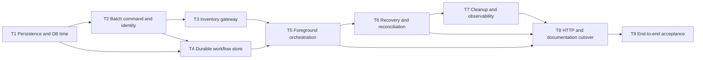

# Reservation Creation Implementation Tasks

Status: Planned; T1–T9 pending.

## 1. Delivery rules

Each task is one safe, reviewable commit-sized increment. The task describes a commit boundary but
does not authorize committing the working tree automatically. Every task ends with
`mvn -B -ntp clean verify` and keeps all previously delivered behavior green. No task edits the
shipped V1 migration or accesses another service's schema.

The existing single-object POST remains active while the persistence, command, Inventory, and
workflow components are built behind it. T8 performs the public batch-contract cutover after the
foreground, recovery, and cleanup paths are complete. This keeps every earlier commit runnable and
deployable. T9 alone runs the slower isolated container smoke test; fault injection and focused
concurrency tests are added in the task that introduces each relevant boundary.

All references are to this feature's `requirements.md` and `design.md` unless another feature is
named explicitly.

## 2. Dependencies

T3 and T4 may be implemented independently after their stated prerequisites. All other task order
is constrained by the graph.

## 3. Implementation tasks

### T1 — Establish workflow persistence and database time

**State:** Pending.

**Commit:** `feat: add reservation creation workflow persistence`

**Depends on:** None.

**Refs.** requirements.md AC1.2, AC1.8, AC4.2, AC4.10–AC4.11, AC4.14;
design.md §3.1, §4.1–§4.2, §4.4, §6.5, §10.2.

**Scope.**

- Add append-only V2 schema changes for the workflow table, active-reservation lookup index, and
  database-generated Reservation creation timestamp.
- Add the workflow schema and PostgreSQL-backed `DatabaseTimeProvider` without activating the new
  POST contract; the JPA workflow model follows after the normalized command exists.
- Change new Reservation timestamps from JVM assignment to an insert-generated PostgreSQL value.

**DoD.**

- V2 changes only the `reservation` schema, gives `reservations.created_at` a
  `CURRENT_TIMESTAMP` default, creates `reservation_creation_requests` with every state,
  nullability, fingerprint, JSON-shape, status, timing-arithmetic, and attempt-count constraint
  from design §4.1, and creates the exact recovery, cleanup, and active-lookup indexes.
- Migration tests prove V1 is unchanged and recorded once, V2 ownership is the reservation role,
  repeated startup is safe, another-service sentinel is unchanged, and the reservation role still
  cannot mutate a foreign schema.
- Constraint tests reject every invalid workflow state/field combination and accept representative
  pending, completed, and reconciliation rows. Hibernate schema validation succeeds against V2,
  and committed workflow rows survive a second application context.
- `DatabaseTimeProvider` returns one PostgreSQL instant and its UTC date from the materialized
  `clock_timestamp()` query. PostgreSQL tests prove both values represent the same sample, UTC-date
  conversion is correct immediately before and at midnight, and changing the session timezone does
  not change the derived date.
- `Reservation.timestamp` is insert-only and database-generated. Existing POST persistence tests
  bracket `created_at` with PostgreSQL time, prove microsecond precision and immediate availability
  after flush, and no longer compare production results to `Instant.now()`.
- Unit tests run without Spring and mock the database-time boundary where needed.
- `mvn -B -ntp clean verify` reports `BUILD SUCCESS` with no skipped checks.

### T2 — Define the batch command, validation, and request identity

**State:** Pending.

**Commit:** `feat: define reservation batch creation command`

**Depends on:** T1.

**Refs.** requirements.md AC1.3–AC1.6, AC1.8, AC4.1, AC4.3, AC4.5, AC4.9;
design.md §2.1–§2.2, §3.1, §4.3, §10.1.

**Scope.**

- Add the batch request DTOs, normalized service command records, stable validation helpers,
  canonical UUID-v4 header parsing, and semantic fingerprinting.
- Keep these components behind the existing endpoint until T8.

**DoD.**

- DTO tests enforce nonblank, maximum-64-character common identifiers; 1–100 non-null items;
  required serial/date members; strict ISO dates in years 0001–9999; inclusive same-day periods;
  and case-sensitive duplicate serial rejection with each later duplicate reported at its exact
  `items[i].serialNumber` path.
- Tests preserve existing Jackson scalar-to-string behavior and reject unknown properties,
  malformed JSON, arrays/objects that cannot bind to strings, nulls, reversed dates, and all other
  stable invalid forms. Reservation adds no serial syntax, blank, or length rule owned by
  Inventory.
- Dynamic validation accepts a supplied PostgreSQL UTC date, accepts start dates equal to or after
  it, and rejects earlier dates. Tests prove this check can run only for a new or logically expired
  intent and cannot reject a resume or replay after midnight.
- Header tests require exactly one plain canonical UUID-v4 `Idempotency-Key`, accept either hex
  case and normalize through `UUID`, and reject missing, repeated, malformed, non-v4, or decorated
  values before persistence or Inventory interaction.
- Fingerprint tests cover every common and item field, item count and order, and string case. They
  prove JSON whitespace and property order are irrelevant while any semantic change changes the
  lowercase 64-character SHA-256 result.
- All helpers have no Spring context in unit tests; architecture checks accept the new types in the
  existing packages without a layer exception.
- `mvn -B -ntp clean verify` reports `BUILD SUCCESS` with no skipped checks.

### T3 — Add the idempotent Inventory reservation gateway

**State:** Pending.

**Commit:** `feat: add inventory reservation gateway`

**Depends on:** T2.

**Refs.** requirements.md AC3.1–AC3.10, AC4.7, AC5.1–AC5.4;
design.md §5, §8.1, §10.1–§10.2;
[Inventory Status Transition design](../../../rent-flow-inventory/.specs/inventory-status-transition/design.md)
§2.1, §3.3, §5, §9.

**Scope.**

- Add the named declarative Inventory HTTP client, domain gateway, response decoder, timeouts, and
  Pricing-aligned Resilience4j retry and circuit breaker.
- Expose domain outcomes to later orchestration without leaking Spring HTTP exception types.

**DoD.**

- Client tests assert exact `PATCH /api/v1/inventory/status`, one unchanged idempotency header,
  `application/json`, request-order preservation, and a body containing each serial exactly once
  with literal target status `RESERVED`.
- Adapter tests accept only exact empty `204` as success and exhaustively classify documented
  `400`, `404`, lifecycle `409`, idempotency `409`/`422`, mixed missing/unavailable failures, every
  `5xx`, resource-access failures, undecodable problems, unexpected `4xx`, and every unexpected
  normal status. Failed items map back to their original request indexes and raw upstream content
  is never exposed.
- Retry tests prove resource-access and only `502`/`503`/`504` receive one delayed physical retry,
  using the identical key and body. All other outcomes receive no synchronous retry.
- Real Resilience4j registry tests prove Retry is inside CircuitBreaker, a recovered retry is one
  breaker success, an exhausted sequence is one breaker failure, recorded/ignored outcomes match
  design §5.4, and an open circuit invokes neither Retry nor the HTTP client.
- Configuration tests prove the Inventory base URL override, 500 ms connect timeout, 1500 ms read
  timeout, two retry attempts with 500 ms and 20-percent randomized wait, count window 20, minimum
  10 calls, 50-percent threshold, 30-second open wait, and three half-open probes.
- No adapter test opens a Spring application context unless configuration wiring itself is under
  test; Mockito is used for direct collaborators.
- `mvn -B -ntp clean verify` reports `BUILD SUCCESS` with no skipped checks.

### T4 — Implement the durable creation workflow store

**State:** Pending.

**Commit:** `feat: persist idempotent reservation creation intents`

**Depends on:** T1 and T2.

**Refs.** requirements.md AC4.2–AC4.6, AC4.9–AC4.11, AC4.14;
design.md §3.1, §3.4, §4, §6.1, §6.5, §10.1–§10.2.

**Scope.**

- Add `ReservationCreationRequest`, its state/outcome records, and JSON mappings against the V2
  workflow table.
- Implement transactional workflow registration, fingerprint comparison, semantic replay,
  foreground lease ownership, state transitions, outcome snapshots, and repository primitives.
- Keep remote HTTP outside this store and outside every database transaction.

**DoD.**

- Registration tests prove stable validation precedes workflow access, new/expired intent date
  validation uses the transaction's database UTC date, and a valid normalized command is committed
  before any caller could invoke Inventory.
- Exact-key concurrent tests prove only one execution receives the 30-second lease; another gets
  busy with `Retry-After: 1`; expired lease takeover succeeds; and the old owner cannot change,
  release, complete, or finalize the row.
- Existing-row tests compare fingerprints before state behavior, preserve a mismatched row while
  returning `IDEMPOTENCY_KEY_REUSED`, replay unexpired completed success and business failures
  without mutable-state checks, and resume matching pending phases without new-intent date
  validation.
- Logical-expiry tests use PostgreSQL time to replace an expired completed row under lock before
  physical cleanup, allow a changed payload only after expiry, and never treat
  `RECONCILIATION_REQUIRED` as reusable or automatically resumable.
- Native repository tests prove foreground conditional claims and ordered recovery claims use
  owner-checked updates and `FOR UPDATE SKIP LOCKED` correctly under multiple application
  contexts.
- Every registration, lease, phase, retry, completion, and expiry field derives from PostgreSQL
  time. Exact arithmetic and session-timezone independence are verified without application-clock
  assertions.
- Transaction fault tests prove serialization, flush, constraint, and commit failures cannot
  publish a terminal outcome or corrupt the last committed phase.
- `mvn -B -ntp clean verify` reports `BUILD SUCCESS` with no skipped checks.

### T5 — Orchestrate local admission, Inventory claim, and finalization

**State:** Pending.

**Commit:** `feat: orchestrate reservation batch creation`

**Depends on:** T3 and T4.

**Refs.** requirements.md AC1.1–AC1.2, AC1.7–AC1.8, AC2.1–AC2.6,
AC3.1–AC3.9, AC4.2, AC4.4, AC4.7, AC4.9, AC4.11, AC4.13;
design.md §1.3, §3, §5.2, §6.2, §7, §10.1–§10.2, §11.

**Scope.**

- Implement `ReservationCreationService` foreground execution through local admission, one
  Inventory batch claim, final local recheck, atomic Reservation inserts, and terminal outcome.
- Verify the service directly while the public endpoint still uses its old contract.

**DoD.**

- Local admission queries at most 100 distinct request serials using exactly `HELD`/`CONFIRMED`
  plus inclusive `endDate >= acceptedDate`. Tests cover every status, before/equal/after end-date
  boundaries, future starts, irrelevant requested-period overlap, case sensitivity, and unchanged
  historical rows.
- Any pre-claim conflict produces one request-ordered failure for every and only conflicting item,
  stores the complete terminal `409 ACTIVE_RESERVATION_EXISTS` outcome, creates no Reservation,
  and proves zero Inventory interactions for the whole batch.
- A clear local check commits `PENDING_INVENTORY` before the gateway call. The service sends one
  ordered claim with the stored key and maps every terminal or temporary Inventory result to the
  exact local status/code while persisting no reservations for rejected batches.
- Exact `204` enters one final transaction that repeats the active query, inserts every requested
  Reservation with generated UUID, PostgreSQL timestamp, `HELD`, common customer/order data and
  item dates, flushes them, and stores the ordered `201` snapshot atomically.
- Finalization fault tests cover failure before inserts, during any insert/flush, while serializing
  the success snapshot, and at transaction commit. Every case leaves zero batch reservations and a
  recoverable `PENDING_INVENTORY` intent.
- If a local active row appears after Inventory succeeds, tests prove no second active reservation
  is inserted, no compensating `AVAILABLE` request is sent, and the stored result becomes `503
  CREATION_RECONCILIATION_REQUIRED`.
- Foreground same-key resumption after simulated response loss reuses the exact Inventory key/body,
  creates each reservation at most once, and returns stable IDs, timestamps, status, and ordering.
- Concurrent service-level claims for one serial prove at most one intent finalizes and every
  losing batch persists none of its reservations; no claim is made about concurrent PUT.
- `mvn -B -ntp clean verify` reports `BUILD SUCCESS` with no skipped checks.

### T6 — Recover unfinished intents and quarantine ambiguous outcomes

**State:** Pending.

**Commit:** `feat: recover unfinished reservation creations`

**Depends on:** T5.

**Refs.** requirements.md AC3.5, AC3.8–AC3.9, AC4.6–AC4.9, AC4.12–AC4.14,
AC5.1–AC5.4; design.md §3.4, §5.3–§5.4, §6.1–§6.4, §8.1–§8.2, §10.

**Scope.**

- Add scheduled recovery, owner-checked attempt accounting and retry release, bounded backoff, and
  terminal reconciliation handling.
- Keep PostgreSQL as the authority for due, lease, and recovery-deadline decisions.

**DoD.**

- The fixed-delay scheduler defaults to 30 seconds, selects no more than 100 due keys per run, and
  claims each immediately before processing. Tests prove one failed row does not stop later rows,
  a run does not overlap itself, and multiple instances cannot own the same live lease.
- Recovery resumes `PENDING_LOCAL_CHECK` from the stored accepted date and
  `PENDING_INVENTORY` with the exact stored ordered serial list and key. It does not depend on
  another client request or any in-memory state.
- An owner-checked short transaction increments `attempt_count` immediately before every logical
  Inventory execution. Temporary failures clear the lease and let SQL derive `next_attempt_at`
  from PostgreSQL time plus exponential 30-second-to-30-minute backoff with 20-percent jitter;
  Inventory busy honors its retry-after duration.
- Crash/fault tests cover lease acquisition before processing, attempt increment before HTTP,
  Inventory commit with a dropped response, failure before retry release, and lease expiry during
  HTTP. A replacement owner can recover, a stale owner cannot finalize, duplicate remote calls use
  the same idempotency key, and local rows remain at-most-once.
- Before every automatic or foreground Inventory call, an owner-checked database-time predicate
  enforces `recovery_deadline`. At or after it, no HTTP call or Reservation insert occurs and the
  row retains a sanitized `503 CREATION_RECONCILIATION_REQUIRED` outcome indefinitely.
- Unexpected normal statuses, undecodable responses, and other protocol ambiguity immediately
  enter reconciliation with replayable `502 INVENTORY_SERVICE_ERROR`; post-claim local conflicts
  retain the `503` reconciliation outcome. Neither path sends a blind Inventory release.
- Configuration validation rejects nonpositive durations, batch sizes outside 1–100, maximum
  backoff below initial backoff, and jitter outside `[0,1)`.
- Recovery tests use Mockito for orchestration and real PostgreSQL for leasing, due selection,
  deadline comparison, multi-instance locking, and persisted restart behavior.
- `mvn -B -ntp clean verify` reports `BUILD SUCCESS` with no skipped checks.

### T7 — Clean terminal records and expose bounded observability

**State:** Pending.

**Commit:** `feat: clean and observe reservation creation workflows`

**Depends on:** T6.

**Refs.** requirements.md AC4.10, AC4.12, AC4.14, AC5.5;
design.md §6.5, §8, §10.1–§10.2, §11.1.

**Scope.**

- Add terminal cleanup, creation/recovery metrics, backlog gauges, and sanitized operational logs.
- Preserve pending and reconciliation records regardless of age.

**DoD.**

- Cleanup defaults to daily at 03:00 UTC, uses separate transactions of at most 1000 rows ordered
  by expiry and key with `FOR UPDATE SKIP LOCKED`, and starts no new chunk after the configurable
  60-second runtime budget.
- PostgreSQL tests prove request handling treats `expires_at <=` database time as logically expired
  before cleanup; cleanup deletes only expired `COMPLETED` rows; and unexpired completed, pending,
  reconciliation, locked, and newly reused keys are preserved.
- Concurrent cleanup workers skip locked rows without duplicate effects. A chunk failure stops that
  run, records the failure, and leaves committed prior chunks and all unrelated rows intact.
- Metrics expose the named Resilience4j series and bounded outcomes for attempts, replays,
  mismatches, busy responses, active conflicts, Inventory rejection/unavailability, completion,
  resumption, reconciliation, recovery runs, cleanup, due pending, expired completed, and
  reconciliation backlog.
- Tests inspect every custom meter tag and captured operational log to prove idempotency keys,
  serial numbers, customer IDs, order IDs, request bodies, upstream bodies, SQL, and stack traces
  are absent. Counts distinguish logical workflow executions from physical HTTP retries.
- Cleanup eligibility and backlog queries use PostgreSQL time; the JVM cron only wakes the job.
  Startup fails for an invalid cron or nonpositive runtime budget.
- `mvn -B -ntp clean verify` reports `BUILD SUCCESS` with no skipped checks.

### T8 — Cut over the POST API and publish its contract

**State:** Pending.

**Commit:** `feat: expose idempotent reservation batch creation`

**Depends on:** T5, T6, and T7.

**Refs.** requirements.md AC1.1–AC1.8, AC2.1–AC2.6, AC3.3–AC3.9,
AC4.1, AC4.4–AC4.6, AC4.10, AC4.12–AC4.13, AC6.1–AC6.4;
design.md §1.1, §2, §7, §9, §10.2–§10.3, §11.2.

**Scope.**

- Replace the public single-object POST binding with the batch envelope and connect it to the
  completed creation workflow.
- Add creation-specific Problem Details mappings, generated OpenAPI assertions, and executable
  README examples while preserving all non-POST contracts.

**DoD.**

- Full-stack tests prove a valid unauthenticated batch of one and 100 items returns `201` with a
  direct request-ordered `ReservationDTO` array, all eight exact fields per item,
  `Idempotency-Replayed: false`, database-recorded expiry, no partial result, and no `Location`.
- Controller tests exhaust the stable validation and key-header matrices from T2 and prove every
  failure returns before workflow persistence or Inventory. Today/future validation uses the
  database UTC date rather than the application host or database session timezone.
- Integration tests assert exact RFC 9457 fields and request-ordered failed-item fields for local
  active conflicts, missing Inventory items, unavailable/mixed items, Inventory busy, invalid
  Inventory references, key mismatch, protocol error, temporary unavailability, and reconciliation.
- Same-key completed replays return the original status/body plus `Idempotency-Replayed: true` and
  unchanged expiry without local checks, Inventory calls, or inserts. Busy, mismatch, unfinished
  `503`, and reconciliation responses expose only the headers defined in design §2.4.
- Generated OpenAPI retains operation ID `createReservation`, documents exact envelope schemas,
  bounds, date semantics, UUID-v4 header, response headers, direct success array, omitted
  `Location`, failed-item schema, and exactly the applicable `201`, `400`, `406`, `409`, `415`,
  `422`, `500`, `502`, and `503` responses.
- README contains copyable batch creation and same-key replay commands and explains key scope,
  same-key retry, busy delay, indeterminate `502`/`503`, reconciliation, Inventory configuration,
  resilience defaults, recovery, seven-day boundaries, metrics, and coordinated Inventory rollout.
- GET, list, PUT, and DELETE regression tests remain unchanged in behavior. PUT does not acquire a
  creation lease or invoke Inventory, and tests make no unsupported serialization guarantee for a
  PUT racing after POST's final local check.
- Architecture tests cover the new controller, DTO, converter, service, repository, entity, and
  nested `service.rest` types without adding a layer exception.
- `mvn -B -ntp clean verify` reports `BUILD SUCCESS` with no skipped checks.

### T9 — Prove end-to-end concurrency, restart, and container recovery

**State:** Pending.

**Commit:** `test: verify reservation creation recovery`

**Depends on:** T8.

**Refs.** requirements.md AC1.1, AC1.7, AC2.5, AC3.1–AC3.2, AC3.9,
AC4.4–AC4.14, AC5.4–AC5.5, AC6.2–AC6.3; design.md §3.3–§3.4, §6, §9–§11.

**Scope.**

- Add cross-cutting acceptance tests for real PostgreSQL concurrency, process restart, response
  loss, and the isolated container topology.
- Close traceability and run the complete repository acceptance commands.

**DoD.**

- Concurrent end-to-end tests use distinct Reservation keys against an Inventory fixture that
  serializes item claims. For overlapping batches, at most one intent creates an active
  Reservation for a serial and every losing batch persists none of its items.
- Restart tests prove pending local and pending Inventory phases resume from PostgreSQL, completed
  success and failure snapshots replay with identical IDs/timestamps/order, and expiry/reuse works
  before physical cleanup. An originally active blocker becoming outdated does not change a saved
  conflict.
- A deterministic Inventory fixture commits `204` idempotently and can drop the response. Tests
  stop/restart Reservation after the remote commit and before local completion, then prove recovery
  uses the same key/body and creates the batch exactly once.
- Seven-day boundary tests prove automatic calls continue strictly before the database deadline,
  stop at equality, and retain reconciliation state. Session timezone and simulated
  service-instance clock differences cannot change accepted dates, leases, due work, or expiry.
- The isolated Compose topology includes the deterministic Inventory fixture, supplies
  `INVENTORY_BASE_URL`, creates and replays a batch, preserves its exact response across application
  and stack restart with the PostgreSQL volume retained, and exercises Inventory outage followed by
  recovery.
- Existing container assertions remain active: PostgreSQL 18.4 prerequisites, restricted role and
  owned schema, unprivileged application runtime, bounded polling/cleanup, readiness `503` during
  database outage, liveness `200`, and readiness recovery. Shell scripts pass syntax checks.
- The final trace table is checked against every acceptance criterion, all spec cross-references
  resolve, and the spec self-evaluation report contains no FAIL verdict.
- `mvn -B -ntp clean verify` reports `BUILD SUCCESS`, then
  `./scripts/container-smoke-test.sh` completes successfully with no skipped checks.

## 4. Acceptance-criteria traceability

| Acceptance criteria | Design | Regression-sensitive task evidence |
| --- | --- | --- |
| AC1.1–AC1.2 | §2.3, §3.4, §4.1 | T1 DB timestamp mapping; T5 atomic ordered creation; T8 exact HTTP success |
| AC1.3–AC1.6 | §2.1, §3.1 | T2 exhaustive command validation; T8 controller noninteraction matrix |
| AC1.7 | §3.4, §4.2 | T5 transaction faults; T8/T9 no-partial-result assertions |
| AC1.8 | §3.1, §4.4, §10.1–§10.2 | T1 database UTC snapshot/session zones; T5 accepted-date query |
| AC2.1–AC2.4 | §3.2, §11.2 | T5 full status/date/future-start matrix; T8 exact conflict response |
| AC2.5 | §3.3, §10.2 | T5 service concurrency and T9 serialized cross-service competition |
| AC2.6 | §3.2 | T5 all-conflict collection and zero-gateway verification |
| AC3.1–AC3.2 | §5.1–§5.2 | T3 exact request/response adapter tests; T5 ordered gateway invocation |
| AC3.3–AC3.8 | §2.4, §5.2, §7.1 | T3 exhaustive decoding; T5 persistence outcomes; T8 exact problems |
| AC3.9 | §2.4, §5.3–§5.4, §6.2–§6.3 | T3 resilience exhaustion; T5 pending intent; T6 recovery; T8 `503` |
| AC3.10 | §1.1, §5.1 | T3 HTTP-only adapter and architecture boundaries |
| AC4.1 | §2.2 | T2 header parser and T8 no-side-effect HTTP matrix |
| AC4.2–AC4.3 | §3.1, §4.1–§4.3 | T2 fingerprint and T4 pre-remote durable registration |
| AC4.4–AC4.6 | §2.2–§2.4, §3.1, §6.1–§6.2 | T4 stored replay/mismatch/lease; T8 response headers and noninteraction |
| AC4.7–AC4.9 | §3.1, §3.4, §6.1–§6.3 | T5 foreground resumption; T6 crash recovery; T9 restart/lost response |
| AC4.10 | §2.3, §4.1, §6.5 | T4 logical expiry; T7 safe cleanup; T8 stable expiry header |
| AC4.11 | §3.4, §4.3 | T1 generated timestamps; T5 atomic snapshots/faults; T9 exact restart replay |
| AC4.12–AC4.13 | §3.2, §6.4, §7.1 | T5 post-claim conflict; T6 exact deadline and reconciliation tests |
| AC4.14 | §4.1, §4.4, §6 | T1 DB snapshot; T4/T6/T7 database-derived timing assertions |
| AC5.1–AC5.2 | §5.3 | T3 retry predicate and exact physical-attempt counts |
| AC5.3–AC5.4 | §5.4, §6.2–§6.3 | T3 decorator/breaker tests; T6 open-circuit recovery behavior |
| AC5.5 | §8.2 | T7 exhaustive bounded meter/log inspection; T9 operational acceptance |
| AC6.1 | §7 | T8 exact Problem Details and failed-item assertions |
| AC6.2 | §2, §7, §9 | T8 generated OpenAPI field/header/status assertions |
| AC6.3 | §6.2–§6.5, §9 | T8 executable README retry/reconciliation examples; T9 container replay |
| AC6.4 | §1.1, §9 | T8 unauthenticated full-stack creation |

No acceptance criterion is deferred to documentation alone. Every criterion has a test or
inspection in the DoD that would fail if its behavior regressed.
