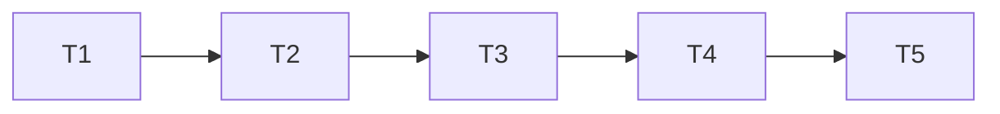

# Reservation Creation Implementation Tasks

Status: Implemented and verified.

Each task is one safe commit. The dependency graph is:

## T1 — Replace the workflow schema with a terminal ledger

**State:** Completed.

**Commit:** `refactor: replace reservation creation workflow with terminal ledger`

**Depends on:** None.

**Refs.** requirements.md AC4.2–AC4.10, AC5.6; design.md §3, §4.

**Scope.**

- Rewrite the unshipped V2 migration and remove V3.
- Reduce the creation-request entity and repository to Inventory-style terminal idempotency.
- Add advisory locking, PostgreSQL UTC time, terminal replay, expiry replacement, and cleanup
  queries.

**DoD.**

- Migration tests assert that V1 and replacement V2 apply and that the ledger has exactly six
  columns: key, fingerprint, HTTP status, outcome, recorded time, and expiry.
- PostgreSQL constraints reject invalid fingerprints, statuses, outcome/status disagreement, and
  expiry disagreement.
- Tests prove the advisory lock is immediate, an exact row can be locked, database UTC date is
  session-timezone independent, and expired cleanup uses bounded skip-locked chunks.
- Production code contains no workflow state, payload, lease, retry-at, attempt, recovery deadline,
  or reconciliation column.
- `mvn -B -ntp clean verify` reports `BUILD SUCCESS`.

## T2 — Replace workflow orchestration with one synchronous service

**State:** Completed.

**Commit:** `refactor: simplify synchronous reservation creation`

**Depends on:** T1.

**Refs.** requirements.md AC1.1–AC4.9; design.md §1.2, §2, §3, §7.

**Scope.**

- Make `ReservationCreationService` own the transaction, idempotency decision, local check,
  Inventory call, reservation inserts, response snapshot, and creation metrics.
- Replace preparation/state/result abstractions with a small nested result.
- Return busy and mismatch through the service result without another exception type.
- Remove the store, recovery, lease, settings, and redundant outcome/metrics services.

**DoD.**

- Tests prove successful batches persist all reservations and the exact `201` snapshot atomically
  and preserve request ordering.
- Tests prove command validation and every known local/Inventory rejection persist terminal
  outcomes and replay them without another local query, Inventory call, or reservation write.
- Tests prove response loss followed by a same-key retry can use Inventory's replay and commit the
  local success.
- Tests prove matching replay preserves IDs, timestamps, status, body, and expiry; mismatch returns
  `422`; concurrent same-key execution returns immediate `409` and `Retry-After: 1`.
- Active checks cover HELD, CONFIRMED, CANCELLED, expired end date, end date equal to today, future
  start, case sensitivity, and complete request-ordered failures.
- Different-key competing requests prove Inventory permits at most one successful batch.
- Transport and protocol failures write no terminal ledger row and create no reservations.
- The bean graph has no creation recovery worker, workflow store, lease logic, or reconciliation
  state.
- `mvn -B -ntp clean verify` reports `BUILD SUCCESS`.

## T3 — Retain five bounded Inventory attempts

**State:** Completed.

**Commit:** `test: verify bounded inventory retries`

**Depends on:** T2.

**Refs.** requirements.md AC3.1–AC3.10, AC5.1–AC5.5; design.md §2.4, §5.

**Scope.**

- Retain the Resilience4j policy and its Inventory protocol mapping.
- Verify retry selection, attempt count, delays, and circuit-breaker composition against the new
  orchestration.

**DoD.**

- Tests prove resource access and HTTP 502/503/504 produce at most five calls with the same key and
  payload.
- Tests prove nominal waits of 200, 400, 800, and 1600 ms with ±20-percent jitter without sleeping.
- HTTP 500, terminal 4xx results, decoded business results, and unexpected normal statuses are not
  retried.
- Retry remains inside the circuit breaker; an exhausted sequence counts as one breaker failure and
  an open breaker makes no HTTP call.
- Exhaustion maps to unstored `503`; malformed protocol maps to unstored `502`.
- `mvn -B -ntp clean verify` reports `BUILD SUCCESS`.

## T4 — Keep terminal cleanup and update the public contract

**State:** Completed.

**Commit:** `docs: document terminal reservation idempotency`

**Depends on:** T3.

**Refs.** requirements.md AC4.8–AC4.10, AC6.1–AC6.4; design.md §6, §8.

**Scope.**

- Adapt the cleanup-only scheduler to the six-column ledger.
- Update OpenAPI, README, the implementation walkthrough, and the system-design decision note.
- Remove documentation of leases, phases, client-driven workflow resumption, and reconciliation.

**DoD.**

- Cleanup tests prove only expired ledger rows are deleted, chunks are bounded, locked rows are
  skipped, runtime is bounded, and reservation rows remain untouched.
- Metrics use bounded outcome labels and contain no identifiers or request values.
- OpenAPI tests cover the batch request, terminal replay headers, busy/mismatch behavior, retry
  guidance, and applicable 201/400/409/422/502/503 responses.
- README and walkthrough describe the six-column terminal table, one synchronous transaction, five
  foreground attempts, stored business outcomes, unstored infrastructure failures, and cleanup-only
  background work.
- Source and docs contain no recovery scheduler, durable retry queue, processing lease, retry
  deadline, or reconciliation workflow.
- `mvn -B -ntp clean verify` reports `BUILD SUCCESS`.

## T5 — Complete regression and specification verification

**State:** Completed.

**Commit:** `test: verify terminal reservation creation flow`

**Depends on:** T4.

**Refs.** requirements.md AC1.1–AC6.4; design.md §9.

**Scope.**

- Run the complete unit, PostgreSQL integration, migration, OpenAPI, formatting, and architecture
  suite.
- Self-evaluate the final requirements, design, and task documents.

**DoD.**

- Every acceptance criterion has a regression assertion that would fail if its observable behavior
  changed.
- Migration tests confirm only V1 and the replacement V2 are required from an empty schema.
- Architecture tests confirm Reservation has no Inventory repository or direct Inventory-schema
  access.
- `git diff --check` reports no whitespace errors.
- The spec self-evaluation has no failing checklist item.
- `mvn -B -ntp clean verify` reports `BUILD SUCCESS` without skipped checks.
