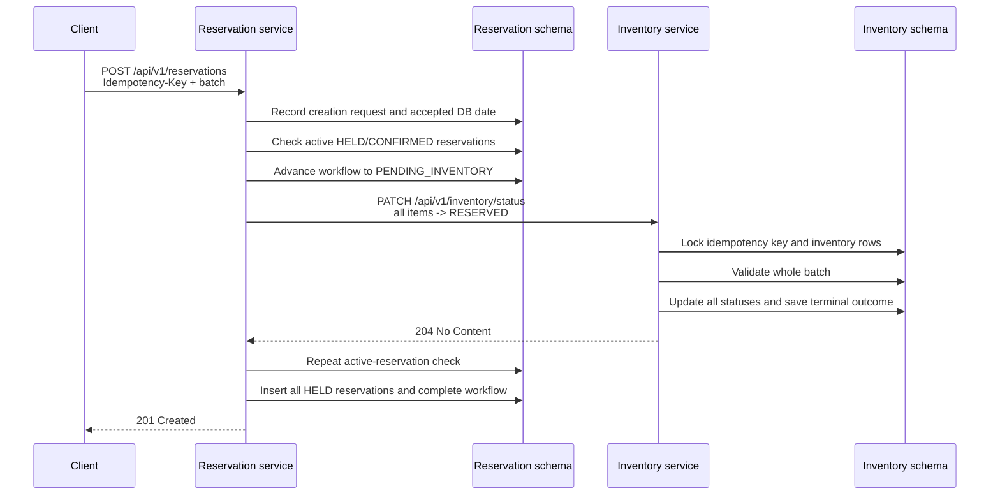

# Reservation creation: system design analysis

_Reviewed on 2026-09-09_

## Scope

This report evaluates reservation creation as one distributed business operation across the
Reservation and Inventory services. It covers consistency, concurrency, idempotency, retries,
failure recovery, API semantics, service ownership, and the wider reservation lifecycle.

The main implementation points reviewed in Reservation are:

- `ReservationCreationService`
- `ReservationCreationStoreService`
- `ReservationCreationRequestRepository`
- `RestInventoryService`
- the `reservation_creation_requests` workflow table
- the scheduled recovery and cleanup jobs

The main implementation points reviewed in Inventory are:

- `IdempotentStatusTransitionService`
- `InventoryStatusTransitionRequestRepository`
- the Inventory status transition matrix
- the `inventory_status_transition_requests` idempotency table
- the ordinary Inventory update and delete paths

## Assessment

The current implementation is technically careful. In particular, Inventory makes the batch
status transition atomic and serializes competing attempts correctly. Reservation preserves enough
state to survive process crashes, safely replays completed requests, and keeps remote HTTP calls
outside database transactions.

For a workflow involving two services and one remote step, however, the Reservation side carries a
large amount of coordination machinery: durable workflow states, leases, two retry layers, a
recovery scheduler, deadlines, retained outcomes, cleanup, reconciliation states, protocol-error
mapping, and metrics. That machinery is not inherently wrong, but it is compensating for a more
fundamental model problem: both services record part of the same business fact, while Inventory
does not know which reservation owns `RESERVED` and does not expose an ownership-aware release
operation.

The result is a robust creation path inside an incomplete lifecycle. Creation can leave an item
reserved in Inventory when Reservation cannot safely finish, and later cancellation, deletion,
expiry, rental, and return paths are not governed by the same cross-service invariant. The current
design is therefore stronger than a simple synchronous integration, but it has much of the cost of
a saga without all of the domain operations needed to complete that saga safely.

My recommendation depends on the intended service boundary:

1. If RentFlow is still small and these services share one deployment and one PostgreSQL database,
   put reservation and inventory allocation in one bounded context or modular monolith and use one
   local ACID transaction. This is the simplest reliable design.
2. If Reservation and Inventory must remain independently owned services, keep Inventory as the
   concurrency authority, but replace the generic `AVAILABLE -> RESERVED` update with an explicit,
   durable inventory claim resource. Give that claim an owner ID and idempotent create, release, and
   consume operations. Keep durable orchestration, but simplify its states and expose pending work
   honestly as an asynchronous operation.

## Current end-to-end process

The current happy path is:



### 1. Request validation and identity

The Reservation endpoint accepts a batch with common `customerId` and `orderId`, plus one entry per
item containing `serialNumber`, `startDate`, and `endDate`. The public `Idempotency-Key` identifies
the whole batch.

Stable validation runs before any workflow work. It checks the shape and values that do not depend
on the current date, including duplicate serial numbers and date ordering. The service calculates a
fingerprint from the command so that reuse of the same key with a different payload can be rejected.

Date acceptance uses PostgreSQL time through `DatabaseTimeProvider`. The accepted UTC date is
stored with the workflow request. Recovery therefore continues using the same accepted date rather
than reinterpreting the command according to a later application-clock value.

### 2. Durable Reservation workflow

Reservation stores an entry in `reservation_creation_requests`. The relevant states are:

- `PENDING_LOCAL_CHECK`
- `PENDING_INVENTORY`
- `COMPLETED`
- `RECONCILIATION_REQUIRED`

The entry also stores the fingerprint, original payload, accepted date, attempt information,
recovery deadline, lease ownership, next-attempt time, terminal response, and retention time.

The lease prevents two Reservation workers from executing the same request concurrently. Completed
outcomes are replayed for the retention period. A matching request already being executed produces
an in-progress conflict, while a different payload under the same key produces an idempotency-key
reuse error.

### 3. Local active-reservation check

Reservation looks for rows for any requested serial number where:

- the status is `HELD` or `CONFIRMED`; and
- `endDate >= acceptedDate`.

This implements the agreed rule that an out-of-date `HELD` or `CONFIRMED` reservation does not
block a new reservation. If one requested item has an active conflict, the complete batch fails and
the failure becomes the terminal idempotent outcome.

This check is useful as an early domain-level rejection, but it is not sufficient for concurrency.
Two requests can both observe no row before either inserts its reservation. Inventory is the actual
serialization point for competing claims.

### 4. Atomic Inventory transition

Reservation asks Inventory to transition every serial number to `RESERVED`. Inventory processes the
whole batch in one transaction. It serializes the idempotency key, locks inventory rows in a stable
order, validates that every transition is allowed, updates all rows, records history entries,
and stores the terminal idempotent outcome in the same transaction.

Under the current transition matrix, only an `AVAILABLE` item can become `RESERVED`. Consequently,
two concurrent creations for the same serial number cannot both claim it. The first committed batch
wins; the other request sees the item as unavailable. If any item is missing or unavailable, no item
in the batch changes status.

This is the strongest part of the current design. It avoids the classic check-then-update race by
making validation and mutation one locked Inventory transaction.

### 5. Final Reservation transaction

After Inventory reports success, Reservation repeats its active-reservation check. This detects a
reservation written through another Reservation path during the remote call. If the check is still
clear, Reservation inserts every reservation as `HELD` and completes its workflow in one local
transaction.

If the repeated check finds a conflict, Reservation cannot safely create another active reservation.
It also cannot safely change Inventory back to `AVAILABLE`, because Inventory has no claim owner and
no conditional release operation. The workflow therefore enters `RECONCILIATION_REQUIRED`.

### 6. Retries and recovery

The Inventory HTTP client has a short immediate retry policy and a circuit breaker. It retries
transport failures and selected transient server responses. The public idempotency key is forwarded
to Inventory, so repeated calls are intended to replay the same Inventory result rather than apply
the transition twice.

If immediate attempts cannot establish a terminal result, Reservation releases its workflow lease
and schedules durable recovery. A background worker claims due workflows and tries the Inventory
step again with exponential backoff and jitter. Recovery eventually stops at the configured
deadline and moves the operation to reconciliation.

This supports the important ambiguous-outcome case: Inventory may have committed `RESERVED` even if
Reservation did not receive the response. Retrying the same idempotent Inventory operation lets
Reservation learn the committed result after a timeout or restart.

## What the design does well

### Inventory is the concurrency authority

The item status transition is done under database locks in the service that owns inventory status.
The complete batch is validated before changes are committed. This gives the all-or-nothing behavior
required by the API and prevents two callers from successfully reserving the same item.

An availability endpoint followed by a separate update would be weaker. Any result from the first
call could be stale before the second call arrived. The current atomic transition correctly combines
the availability decision with the claim.

### Idempotency covers ambiguous network outcomes

Both services persist outcomes rather than keeping idempotency only in memory. A process restart,
client retry, or lost HTTP response therefore does not automatically produce duplicate local rows or
duplicate Inventory transitions.

The payload fingerprint also prevents the dangerous interpretation of one key as two different
commands.

### Database transactions are kept local

Reservation does not keep a database transaction open across the Inventory HTTP call. Long
distributed transactions would hold locks while waiting on the network and would couple service
availability tightly. The current code uses short local transactions around state transitions.

### Recovery data is explicit

The original command, accepted date, state, attempts, lease, and terminal outcome are durable. That
makes crash recovery and operational diagnosis possible. The recovery worker can resume work after a
process restart without relying on the original caller.

### The accepted date is stable

Using the database for the accepted time avoids disagreements between application instances and
matches the database-backed time approach used elsewhere in RentFlow. Persisting the accepted date
also prevents a request from changing meaning merely because a retry happens after midnight.

## Where the design is overcomplicated or incomplete

### Reservation and Inventory store an unlinked duplicate fact

Reservation represents allocation with an active `HELD` or `CONFIRMED` row. Inventory represents
the same allocation with the scalar status `RESERVED`. There is no stable identifier connecting
those records.

Inventory cannot answer:

- Which reservation or order owns this `RESERVED` item?
- Is this retry from the same business claim or an unrelated operation?
- May this caller release the item?
- Has the claim been converted into a rental?
- Is a `RESERVED` item orphaned?

An idempotency record is a request-processing aid, not a domain ownership record. It may expire, and
it does not model the ongoing lifetime of the allocation.

### There is no safe compensation

A saga needs forward operations and compensating operations. Reservation currently has the forward
Inventory operation but no ownership-aware inverse operation.

After Inventory commits, any of these events can leave the two services inconsistent:

- Reservation crashes before it records success.
- Reservation exhausts recovery because the Inventory result cannot be decoded.
- The second local conflict check finds a competing reservation.
- The Reservation insert or local commit fails permanently.
- An operator changes or deletes a reservation separately.

Blindly changing the item from `RESERVED` to `AVAILABLE` would be unsafe. The status could now belong
to another workflow or could already have advanced to a later lifecycle state. Compensation must be
conditional on claim ownership.

### The complete lifecycle is not protected

Creation coordinates the services, but ordinary Reservation update/delete operations and ordinary
Inventory update/delete operations can bypass the same invariant. A generic Inventory replacement
can change status without the status-transition lifecycle and its history. Reservation can be
cancelled, changed, or deleted without releasing the Inventory allocation.

Creation should be assessed as part of this lifecycle:

```text
hold/claim -> confirm -> start rent -> return -> inspect/prepare -> available
          \-> cancel or expire -> release
```

Until every state-changing path either participates in that lifecycle or is restricted, the system
cannot guarantee that one active reservation corresponds to exactly one owned inventory claim.

### A `503` can later become a successful reservation

When Inventory is unavailable, the synchronous request can return a service-unavailable response
while the durable recovery worker continues. The caller may reasonably interpret `503` as “the
operation failed,” but Reservation may create the reservations later without another client request.

That is an asynchronous command hidden behind synchronous error semantics. If background work can
still complete, the API should return `202 Accepted` with an operation resource that the caller can
query. If the API returns a terminal error, autonomous work for that operation should stop.

### The workflow contains two retry systems

There is a short Resilience4j retry around the HTTP call and a durable database-backed retry loop.
Both have a purpose: the first absorbs brief faults and the second survives restarts and long
outages. Together, however, they make attempt counts, timing, logs, load, and failure analysis harder
to reason about.

A simpler policy is usually sufficient:

- at most one very short transport retry in the request path; and
- one durable retry policy as the source of truth for all continuing work.

The circuit breaker is useful only if its thresholds, metrics, and operational response are actively
managed. Otherwise it adds another state machine around an already durable one.

### The same external idempotency key crosses service boundaries

Forwarding the public key works mechanically, but it couples the Reservation API namespace to the
Inventory API namespace. The same Inventory endpoint could later be called by another upstream
operation using an identical UUID for unrelated work.

The orchestrator should derive a participant-specific key from its own operation ID and the step,
for example:

```text
reservation operation: 42f3...
inventory claim step:   UUIDv5(namespace, "reservation-create:42f3...:claim")
inventory release step: UUIDv5(namespace, "reservation-create:42f3...:release")
```

The exact representation is less important than stable derivation and separate namespaces.

### Equal retention and recovery windows create an edge risk

Reservation may recover an operation for seven days, while Inventory retains its idempotency result
for seven days. Near the boundary, Inventory could forget a result before Reservation makes its last
retry. Re-executing a forgotten operation may then be interpreted from current state rather than
replay the original outcome.

The participant's deduplication lifetime should exceed the orchestrator's maximum retry horizon by a
clear safety margin. A durable claim resource is better still because its identity lasts for the
business lifetime of the claim rather than an arbitrary retry period.

### Shared PostgreSQL does not make the HTTP workflow atomic

The services currently use one physical PostgreSQL database but separate schemas and roles. Because
they communicate through HTTP and commit separate local transactions, creation is still a
distributed operation. The common database provides a shared operational failure domain; it does
not give atomicity to the two HTTP-mediated commits.

This topology does make a modular-monolith alternative practical. It should be a deliberate
architectural decision, with one component authorized to transact over the required tables, rather
than accidental cross-schema SQL between nominally independent services.

## Failure behavior

| Failure point | Current behavior | Assessment |
|---|---|---|
| Stable request validation fails | No workflow or reservation is created | Correct |
| Active local reservation exists | Whole batch receives a terminal conflict | Correct for the agreed invariant |
| Inventory item is missing or unavailable | Inventory changes nothing; Reservation stores a terminal failure | Correct |
| Inventory response is lost after its commit | Reservation retries the same idempotent Inventory request | Correct and necessary |
| Reservation process stops before the remote call | Lease expires and recovery resumes | Correct |
| Reservation process stops after Inventory success but before local commit | Recovery can replay Inventory success and finish | Usually correct |
| Second local check finds a conflict after Inventory success | Reconciliation required; item can remain `RESERVED` | Safe, but operationally incomplete |
| Inventory returns an unknown or malformed response | Reconciliation required | Conservative, but lacks automated repair |
| Reservation returns unavailable while recovery is scheduled | The operation can later succeed after a perceived failure | Misleading public API semantics |
| Reservation is later cancelled or deleted | No creation-workflow mechanism releases Inventory | Lifecycle gap |
| Inventory `RESERVED` state is changed through a generic endpoint | Reservation may still be active | Lifecycle gap |

## Alternatives

### Alternative A: one bounded context and one database transaction

Reservation creation and inventory allocation run in one application transaction. The transaction
locks the inventory rows, verifies that all are available, checks active reservations, inserts the
reservations, and records the allocation state atomically.

**Advantages**

- Strong consistency with the least code.
- No distributed retry, compensation, lease, or reconciliation workflow.
- Clear all-or-nothing batch behavior.
- Easy failure semantics: commit means success, rollback means failure.
- Straightforward debugging and testing.

**Disadvantages**

- Reservation and Inventory are no longer independently deployable for this operation.
- The combined module owns a larger transaction and data boundary.
- Splitting the services later requires an explicit migration.
- A poorly governed shared schema can create broad coupling.

**When it fits**

This is the best fit when the team, scaling needs, release cadence, and operational ownership are
shared. A modular monolith is an industry-standard choice for avoiding distributed consistency
before independent service boundaries provide enough value to justify it.

### Alternative B: simple synchronous HTTP with client retries

Reservation checks locally, calls Inventory once with an idempotency key, and creates local rows
after success. There is no durable Reservation workflow or recovery scheduler. The caller retries
ambiguous failures.

**Advantages**

- Much less Reservation code and database state.
- Easy request/response model.
- Suitable when occasional manual repair is acceptable.

**Disadvantages**

- A lost response can leave Inventory reserved until the caller retries.
- Recovery depends on client behavior.
- Reservation cannot reliably finish after its own restart without durable intent.
- It still needs Inventory idempotency and a safe release or expiry mechanism.
- Operational repair becomes part of normal reliability.

**When it fits**

This can work for an early internal system with low volume if Inventory claims automatically expire
and the business accepts occasional retry or manual resolution. It is risky with a permanent scalar
`RESERVED` status.

### Alternative C: an ownership-aware claim API with lightweight orchestration

Inventory exposes a business operation such as:

```http
PUT /api/v1/inventory-claims/{claimId}
Content-Type: application/json

{
  "orderId": "...",
  "items": ["SN-1", "SN-2"],
  "expiresAt": "..."
}
```

The claim is a durable Inventory domain resource. It has an owner and states such as `ACTIVE`,
`RELEASED`, and `CONSUMED`. Inventory enforces at most one active claim per item. The orchestrator can
idempotently create, query, release, or consume its own claim.

Reservation maintains a smaller operation record, for example `PENDING`, `SUCCEEDED`, `REJECTED`, or
`NEEDS_ATTENTION`. A fast request can still return `201`; continuing work returns `202` and a URL for
the operation status.

**Advantages**

- Preserves the service boundary and Inventory's concurrency authority.
- Gives compensation an explicit ownership check.
- Makes orphan detection and reconciliation queryable.
- Models business lifetime separately from idempotency retention.
- Supports cancellation, expiry, and conversion to rental.
- Reduces protocol ambiguity because the resource can be read after a timeout.

**Disadvantages**

- Still eventually consistent across services.
- Requires a claim model and lifecycle in Inventory.
- Needs an orchestrator or equivalent process manager.
- Requires clear expiry and ownership rules.

**When it fits**

This is the recommended design when Inventory and Reservation need to remain separate services.

### Alternative D: asynchronous commands with transactional outbox and inbox

Reservation commits an operation and an outbox event in one transaction. A publisher sends an
inventory-claim command. Inventory consumes it idempotently, updates its own database, and emits a
success or rejection event. Reservation consumes that event and completes or rejects the operation.

**Advantages**

- Services remain available during temporary peer outages.
- Durable delivery is explicit and does not depend on an HTTP request remaining open.
- Handles bursts and longer outages well.
- The API naturally exposes a pending operation.

**Disadvantages**

- Adds a broker, outbox publisher, inbox/deduplication, event schemas, and operational monitoring.
- User-visible completion is asynchronous.
- Duplicate and out-of-order delivery must be handled.
- Compensation and claim ownership are still required; messaging alone does not solve consistency.

**When it fits**

Use this when asynchronous UX is acceptable and the system already operates reliable messaging, or
when throughput and outage tolerance justify the extra infrastructure.

### Alternative E: workflow engine

A durable workflow platform such as Temporal, Camunda, or a cloud workflow service executes claim,
reservation persistence, compensation, timeouts, and later lifecycle steps.

**Advantages**

- Durable timers, retries, execution history, and workflow visibility are provided by the platform.
- Long-running multi-step processes are easier to inspect than custom scheduler tables.
- Compensation and human intervention can be modeled explicitly.

**Disadvantages**

- Adds a substantial platform and operational dependency.
- Requires a workflow programming model and deployment expertise.
- Does not remove the need for idempotent participant APIs and ownership-aware compensation.
- Usually excessive for one remote step.

**When it fits**

It becomes attractive when the process expands to payment, confirmation, pickup, expiry, rental,
return, inspection, notifications, and human actions with long-running timers.

### Alternative F: distributed transaction or direct cross-schema transaction

A transaction coordinator or one service writes both schemas in one transaction.

**Advantages**

- Can provide atomic commit across the current data stores.
- Avoids visible intermediate states.

**Disadvantages**

- Breaks or weakens service data ownership.
- Couples schemas, releases, and availability.
- Two-phase commit adds coordinator and recovery complexity when separate resource managers are used.
- Many common service components and external systems do not participate in the transaction.

**When it fits**

If direct transactions are acceptable because both schemas intentionally form one consistency
boundary, call the result a modular monolith or shared transactional component and govern it that
way. It is a poor hidden shortcut between services that claim independent ownership.

## Comparison

| Approach | Consistency | Complexity | Independent services | Failure recovery | Recommended here |
|---|---|---:|---:|---|---|
| One local ACID transaction | Strong | Low | No | Database rollback/retry | Yes, if the boundary can be combined |
| Simple synchronous HTTP | Eventual/partial | Low | Yes | Mostly caller/manual | Only for low-risk early use |
| Claim API + lightweight orchestrator | Eventual with safe compensation | Medium | Yes | Durable and ownership-aware | Yes, if services remain separate |
| Outbox/inbox messaging | Eventual | High | Yes | Durable asynchronous delivery | Later, when scale/outage needs justify it |
| Workflow engine | Eventual | High platform cost | Yes | Platform-managed workflow recovery | Later, for a longer business process |
| Cross-schema or distributed transaction | Strong, depending on implementation | Medium to high | Weak in practice | Transaction manager | Only as a deliberate shared boundary |

## Recommended target design for separate services

### 1. Make the Inventory claim a domain resource

Store a claim with at least:

- `claimId`
- owning Reservation operation ID
- `orderId`, if Inventory needs it operationally
- claim state: `ACTIVE`, `RELEASED`, or `CONSUMED`
- claimed serial numbers
- creation and update timestamps
- optional hold expiry

Enforce one active claim per inventory item with row locking and a database constraint or equivalent
transactional invariant. A status such as `RESERVED` can remain as a projection, but the claim must
carry ownership.

### 2. Expose idempotent lifecycle commands

Inventory should support operations equivalent to:

- create or ensure claim;
- get claim;
- release claim only when the supplied claim owns it;
- consume claim when the rental begins;
- expire a temporary hold, if expiry belongs in Inventory.

These commands should be idempotent by resource identity. Repeating release on an already released
claim should return its existing state rather than mutate an unrelated reservation.

### 3. Use an explicit Reservation operation resource

The Reservation API can retain a synchronous fast path:

- return `201 Created` when claim and local reservation creation finish during the request;
- return a terminal 4xx response for known business rejection;
- return `202 Accepted` with `Location: /api/v1/reservation-creation-operations/{id}` when processing
  will continue after the response.

The operation endpoint should report `PENDING`, `SUCCEEDED`, `REJECTED`, or `NEEDS_ATTENTION` and
return the final reservations or problem details. The existing workflow table can evolve into this
resource rather than being thrown away.

### 4. Define compensation before relying on autonomous recovery

If Inventory claim succeeds but Reservation cannot commit its rows, Reservation should call the
ownership-aware release operation. Both claim and release need stable participant-specific keys.
Unsuccessful compensation should remain visible as `NEEDS_ATTENTION` and be retried or surfaced to
operators.

### 5. Close every lifecycle bypass

Replace generic state mutation with commands that express intent:

- confirm reservation;
- cancel reservation and release claim;
- expire hold and release claim;
- start rental and consume claim;
- return item;
- finish inspection/preparation and make item available.

Restrict or remove generic Inventory status replacement and Reservation update/delete paths that can
violate the cross-service invariant. Administrative repair operations should be explicit, audited,
and ownership-aware.

### 6. Separate hold expiry from rental dates

`endDate` describes the booked rental interval. A temporary `HELD` reservation commonly needs a much
shorter expiry such as `holdExpiresAt`. Using the rental end date as the definition of an active hold
can keep abandoned holds active for the entire future rental period.

Whether confirmed future bookings for the same item should coexist is a product rule. The current
decision is one active reservation per item, so Inventory may represent one active claim. If the
product later allows sequential future bookings, availability becomes interval-based and cannot be
represented by one scalar `RESERVED` status.

### 7. Align retry and retention contracts

Inventory must retain a participant result longer than Reservation can retry it, including clock
skew, scheduler delay, and operational downtime. Participant-specific keys should be stable for the
whole operation. Durable claims themselves should not disappear merely because request-deduplication
records expire.

### 8. Add reconciliation based on business identity

Operational checks should be able to find:

- active Inventory claims without an active Reservation operation;
- active Reservation rows without an active Inventory claim;
- claims stuck beyond their hold expiry;
- operations in `NEEDS_ATTENTION`;
- state transitions performed outside approved lifecycle commands.

This becomes practical once both services share a claim or operation identifier.

## A practical migration path

The current work does not need to be discarded. Its useful pieces can be evolved incrementally:

1. Add `claimId` and claim ownership to Inventory while preserving the existing atomic row-locking
   implementation.
2. Change Reservation to derive a stable Inventory claim ID and participant idempotency keys from
   its creation operation ID.
3. Add Inventory read and conditional-release operations.
4. Use conditional release as compensation for local finalization failure and reconciliation cases.
5. Expose pending Reservation operations with `202 Accepted` and an operation-status endpoint.
6. Replace generic reservation and inventory mutations with lifecycle commands.
7. Add automatic hold expiry and reconciliation reports.
8. Once controlled write paths make Inventory the sole allocation authority, decide whether the
   Reservation pre-check and second check are still needed. Do not remove them while bypass paths
   remain.
9. Simplify retry state, metrics, and scheduler code after claim lookup and compensation remove the
   ambiguous cases they currently defend against.

This approach keeps the reliable parts of the current implementation: atomic Inventory claims,
stable request identity, short local transactions, database-backed time, and durable outcomes. It
moves complexity into an explicit business concept that can support the entire lifecycle.

## Relevant standards and established guidance

There is no single industry standard that mandates one reservation architecture. Common practice is
to choose the smallest consistency mechanism that satisfies the business invariant, keep each
service transaction local, make retryable participant operations idempotent, and use a saga with
compensation for multi-service business operations.

- The [AWS saga orchestration guidance](https://docs.aws.amazon.com/prescriptive-guidance/latest/cloud-design-patterns/saga-orchestration.html)
  describes a central orchestrator, local participant transactions, idempotent operations, semantic
  locking, compensating transactions, and the resulting observability and complexity costs.
- The [Azure saga pattern](https://learn.microsoft.com/en-us/azure/architecture/patterns/saga)
  presents a distributed business transaction as a sequence of local transactions with compensating
  actions when a step fails.
- The [Azure compensating transaction pattern](https://learn.microsoft.com/en-us/azure/architecture/patterns/compensating-transaction)
  emphasizes recording enough information to undo completed work and making compensation itself
  idempotent and resumable.
- The [AWS transactional outbox guidance](https://docs.aws.amazon.com/en_en/prescriptive-guidance/latest/cloud-design-patterns/transactional-outbox.html)
  addresses the database/message dual-write problem and notes that consumers must handle duplicate
  delivery. An outbox improves delivery reliability; it does not replace saga compensation.
- [RFC 9110, section 15.3.3](https://www.rfc-editor.org/rfc/rfc9110.html#name-202-accepted)
  defines `202 Accepted` for requests accepted for processing that have not completed and recommends
  that the response describe current status and point to a status monitor.
- [RFC 9110, section 10.2.3](https://www.rfc-editor.org/rfc/rfc9110.html#name-retry-after)
  defines `Retry-After` primarily for `503 Service Unavailable` and redirection responses. Using it
  on an idempotency-in-progress `409` can be a useful private API convention, but is an extension of
  the standardized semantics and must be documented for clients.
- The [IETF Idempotency-Key HTTP header draft](https://datatracker.ietf.org/doc/html/draft-ietf-httpapi-idempotency-key-header)
  describes key uniqueness, payload fingerprints, expiry policies, and error behavior for concurrent
  or mismatched requests. As of this review it remains an Internet-Draft rather than a final RFC. It
  defines the header as an HTTP Structured Field string; the current raw UUID header is a deliberate
  project-specific contract.
- [Stripe's idempotent request documentation](https://docs.stripe.com/api/idempotent_requests)
  is a widely used production example of persisting and replaying the first result, comparing
  parameters on reuse, and expiring keys after a documented retention period.
- [Temporal workflow documentation](https://docs.temporal.io/workflows) illustrates the durable
  execution and recovery model supplied by a workflow engine.
- The [AWS shared-database guidance](https://docs.aws.amazon.com/prescriptive-guidance/latest/modernization-data-persistence/shared-database.html)
  describes the coupling and development-time tradeoffs of multiple services sharing a database.
- Microsoft's guidance on
  [data sovereignty per microservice](https://learn.microsoft.com/en-us/dotnet/architecture/microservices/architect-microservice-container-applications/data-sovereignty-per-microservice)
  explains the usual rule that a microservice owns its data and other services access it through its
  API or messaging contracts.

## Final judgement

The current creation flow is not poor engineering. It handles concurrency, replay, lost responses,
crashes, and batch atomicity more carefully than a typical first implementation. Its complexity is
real because the system is trying to provide reliable cross-service behavior over an operation that
cannot be atomically committed.

The disproportionate part is the combination of a sophisticated Reservation recovery workflow with
an Inventory model that only records `RESERVED`. Adding more retry branches to Reservation will not
close that gap. Either bring allocation and reservation into one ACID boundary, or make the Inventory
claim an owned, durable domain resource with safe release and consume operations. For the current
size of RentFlow, the single-boundary design is the simplest sound choice. If independent services
are a firm requirement, the claim-resource design is the strongest next step and allows much of the
existing orchestration to become smaller and clearer.
