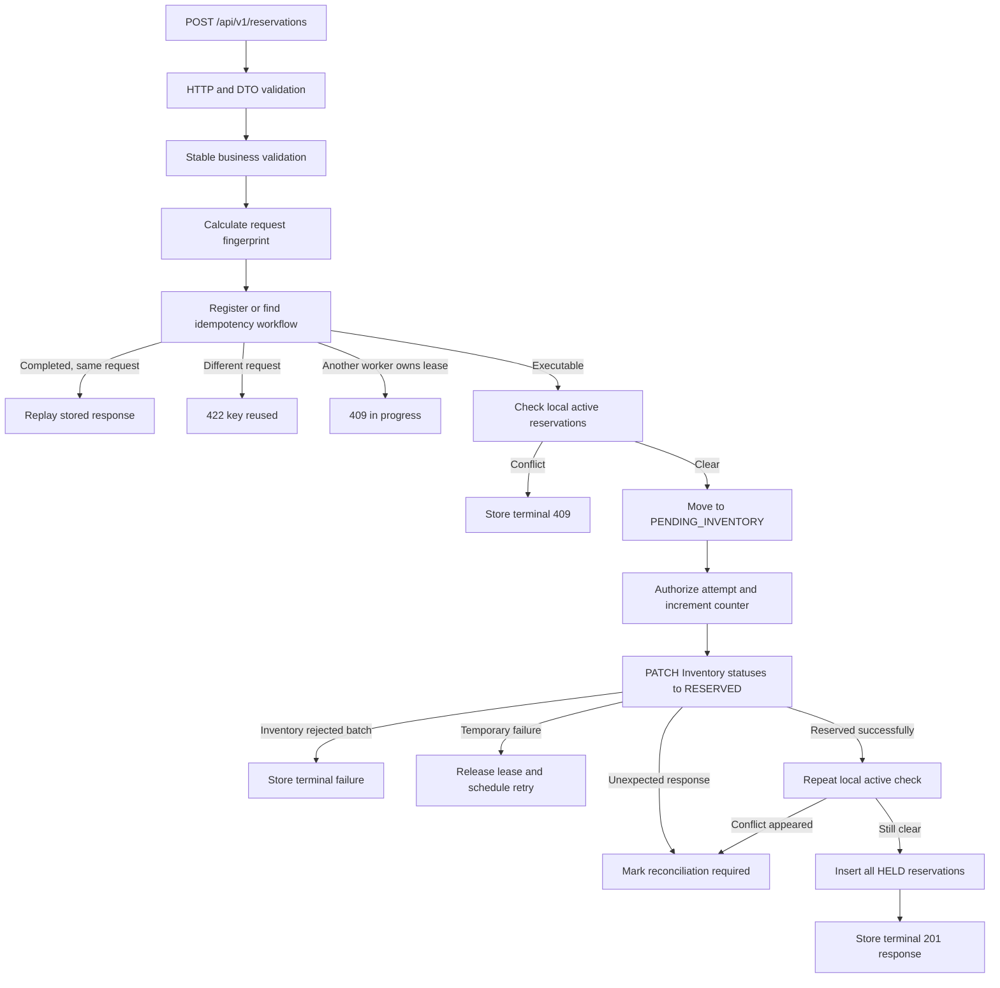

# Reservation Creation Walkthrough

The current implementation treats reservation creation as a persisted workflow. A request is recorded first, processed through several short transactions, sent to Inventory outside any database transaction, and then either completed, scheduled for retry, or marked for reconciliation.

This is the main flow:



## 1. Incoming API request

The entry point is [ReservationController.java](src/main/java/com/rentflow/controller/ReservationController.java#L151).

A request looks like:

```http
POST /api/v1/reservations
Content-Type: application/json
Idempotency-Key: 7db65a9e-7a71-4b6f-ae35-91f85750ce18
```

```json
{
  "customerId": "CUSTOMER-001",
  "orderId": "ORDER-001",
  "items": [
    {
      "serialNumber": "DRILL-001",
      "startDate": "2026-10-01",
      "endDate": "2026-10-03"
    },
    {
      "serialNumber": "DRILL-002",
      "startDate": "2026-10-05",
      "endDate": "2026-10-07"
    }
  ]
}
```

The endpoint consumes one batch envelope:

- `customerId` applies to every reservation.
- `orderId` applies to every reservation.
- `items` contains between 1 and 100 reservations.
- Every item supplies its own serial number and inclusive reservation dates.
- The entire batch succeeds or fails together.

The request DTOs are:

- [CreateReservationsRequest.java](src/main/java/com/rentflow/dto/CreateReservationsRequest.java#L20)
- [CreateReservationItemRequest.java](src/main/java/com/rentflow/dto/CreateReservationItemRequest.java#L12)

Spring validates:

- `customerId` is present, nonblank, and at most 64 characters.
- `orderId` is present, nonblank, and at most 64 characters.
- `items` is present and contains 1–100 elements.
- No item may be `null`.
- Each item must have non-null `serialNumber`, `startDate`, and `endDate`.
- Dates must use strict `uuuu-MM-dd` JSON formatting.

The Reservation service deliberately does not validate the serial-number format during creation. Inventory owns that validation.

Unknown JSON properties are rejected because [application.yaml](src/main/resources/application.yaml#L4) enables `fail-on-unknown-properties`.

If request binding or validation fails, the controller method is never entered. [ApiExceptionHandler.java](src/main/java/com/rentflow/controller/ApiExceptionHandler.java#L72) produces a `400 VALIDATION_FAILED` or `400 MALFORMED_JSON` response. No workflow or reservation is written.

## 2. Idempotency-key validation

Inside the controller, all values of the `Idempotency-Key` header are collected and passed to [IdempotencyKeyParser.java](src/main/java/com/rentflow/service/IdempotencyKeyParser.java#L14).

The parser requires:

- Exactly one header value.
- Canonical hyphenated UUID syntax.
- UUID version 4.
- A valid UUID variant.

For example:

```text
7db65a9e-7a71-4b6f-ae35-91f85750ce18
```

Missing, repeated, comma-combined, malformed, or non-v4 values produce:

```json
{
  "type": "urn:rentflow:problem:validation-failed",
  "title": "Request validation failed",
  "status": 400,
  "detail": "One or more request values are invalid.",
  "instance": "/api/v1/reservations",
  "code": "VALIDATION_FAILED",
  "violations": [
    {
      "field": "Idempotency-Key",
      "message": "must contain exactly one canonical UUID v4 value"
    }
  ]
}
```

No workflow is created in this case.

## 3. Conversion into an internal command

[ReservationConverter.java](src/main/java/com/rentflow/converter/ReservationConverter.java#L13) converts the HTTP DTO into a [ReservationCreationCommand](src/main/java/com/rentflow/model/ReservationCreationCommand.java#L7).

This separation means the persisted workflow does not depend directly on controller DTOs.

The command contains:

```java
ReservationCreationCommand(
    String customerId,
    String orderId,
    List<Item> items
)
```

Each item contains:

```java
Item(
    String serialNumber,
    LocalDate startDate,
    LocalDate endDate
)
```

The records make defensive copies of their lists and reject null values.

## 4. Stable business validation

[ReservationCreationService.start](src/main/java/com/rentflow/service/ReservationCreationService.java#L41) first calls:

```java
ReservationCreationValidation.stable(command)
```

The implementation is in [ReservationCreationValidation.java](src/main/java/com/rentflow/service/ReservationCreationValidation.java#L15).

It checks rules that never depend on the current time:

1. A serial number cannot occur twice in the same batch.
2. Date years must be between `0001` and `9999`.
3. `endDate` must be on or after `startDate`.

For example, duplicate serial numbers produce a violation such as:

```json
{
  "field": "items[1].serialNumber",
  "message": "must not duplicate another item serial number"
}
```

These checks happen before the idempotency workflow is registered. Therefore invalid requests do not consume an idempotency key.

The current-date check is deliberately separate because it needs PostgreSQL time.

## 5. Request fingerprint

The service calculates a SHA-256 fingerprint using [IdempotencyFingerprint.java](src/main/java/com/rentflow/service/IdempotencyFingerprint.java#L15).

The fingerprint includes, in order:

1. A version marker: `reservation-creation-v1`.
2. `customerId`.
3. `orderId`.
4. Number of items.
5. Every item’s:
   - serial number,
   - start date,
   - end date.

Every value is encoded as a length-prefixed UTF-8 sequence before hashing. Length prefixes prevent ambiguous combinations such as `ab + c` and `a + bc` from producing the same input sequence.

The item order is significant. Swapping two items creates a different fingerprint because response order and failure indexes are also significant.

The fingerprint answers one question:

> Does this idempotency key represent exactly the same reservation request?

## 6. Workflow owner and lease

Before registering the workflow, the service creates a random `owner` UUID:

```java
UUID owner = UUID.randomUUID();
```

This owner identifies the specific foreground request or recovery worker currently allowed to modify the workflow.

It is separate from the client’s idempotency key:

- **Idempotency key:** identifies the durable business intent.
- **Lease owner:** identifies the temporary process executing that intent.

The default lease duration is 30 seconds, configured in [application.yaml](src/main/resources/application.yaml#L79).

All important state-changing SQL operations include both the idempotency key and lease owner in their `WHERE` clauses. If an old worker tries to write after another worker has taken over, its update affects zero rows and [requireUpdated](src/main/java/com/rentflow/service/ReservationCreationStoreService.java#L325) throws `ReservationCreationLeaseLostException`.

The orchestration layer catches that exception and returns `409 IDEMPOTENCY_IN_PROGRESS`.

## 7. Registering the workflow

The first database transaction is [ReservationCreationStoreService.prepare](src/main/java/com/rentflow/service/ReservationCreationStoreService.java#L58).

This transaction:

1. Reads PostgreSQL time.
2. Checks whether the idempotency key already exists.
3. Inserts the workflow if it does not exist.
4. Determines whether to execute, replay, reject, or report that another worker is active.

### PostgreSQL time

[DatabaseTimeProviderService.java](src/main/java/com/rentflow/service/DatabaseTimeProviderService.java#L27) executes:

```sql
WITH time_sample AS MATERIALIZED (
    SELECT clock_timestamp() AS observed_at
)
SELECT observed_at,
       (observed_at AT TIME ZONE 'UTC')::date AS utc_date
FROM time_sample
```

This gives the application two values derived from the same PostgreSQL clock sample:

- The precise current instant.
- The current UTC calendar date.

The application server’s clock and timezone are not used for reservation-date decisions.

### New workflow

[insertIfAbsent](src/main/java/com/rentflow/repository/ReservationCreationRequestRepository.java#L24) uses PostgreSQL:

```sql
INSERT ...
ON CONFLICT (idempotency_key) DO NOTHING
```

A newly inserted row starts with:

```text
state             = PENDING_LOCAL_CHECK
lease_owner       = current worker UUID
lease_expires_at  = recorded time + 30 seconds
next_attempt_at   = recorded time
attempt_count     = 0
recovery_deadline = recorded time + 168 hours
```

It also stores:

- The idempotency key.
- Request fingerprint.
- Complete normalized command as JSONB.
- Accepted UTC date.
- Recorded and updated timestamps.

`ON CONFLICT DO NOTHING` handles two requests that concurrently try to create the same idempotency key. One inserts the row; the other sees zero inserted rows and then reads the winner’s row.

### Current-date validation

After registering a new workflow, `prepare` checks every item:

```text
startDate >= acceptedDate
```

`acceptedDate` is the UTC date obtained from PostgreSQL.

The insert and date validation are in the same transaction. If validation fails, the exception rolls back the workflow insertion, so an invalid historical request does not consume the key.

The accepted date is stored with the workflow. Retries and recovery therefore continue using the date on which the intent was accepted instead of allowing a midnight boundary to alter the meaning of an already accepted request.

## 8. Existing idempotency keys

The existing row is read through [findLockedByIdempotencyKey](src/main/java/com/rentflow/repository/ReservationCreationRequestRepository.java#L21), which applies a pessimistic write lock.

[prepareExisting](src/main/java/com/rentflow/service/ReservationCreationStoreService.java#L210) makes the following decision:

| Existing condition | Result |
|---|---|
| Fingerprint differs | `422 IDEMPOTENCY_KEY_REUSED`; original workflow is unchanged |
| State is `COMPLETED` | Replay the stored outcome |
| State is `RECONCILIATION_REQUIRED` | Return its stored reconciliation outcome |
| Pending and lease is still owned | `409 IDEMPOTENCY_IN_PROGRESS` |
| Pending and lease is free or expired | Claim it and continue execution |

A completed row has an expiry exactly seven days after completion.

If the completed row has logically expired, `prepare` deletes it under the row lock and creates a new workflow. This lets the key be reused after the replay period even if scheduled cleanup has not removed the row yet.

Matching completed replays do not rerun:

- Current-date validation.
- Local availability checks.
- Inventory calls.
- Reservation insertion.

They return the stored original response.

## 9. Preparation objects

The store returns a [ReservationCreationPreparation](src/main/java/com/rentflow/model/ReservationCreationPreparation.java#L6).

Its `Type` tells the orchestration service what to do:

- `EXECUTE`: this worker owns the lease and may continue.
- `REPLAY`: return the stored completed outcome.
- `BUSY`: another worker currently owns the intent.
- `MISMATCH`: the key belongs to a different request.
- `RECONCILIATION`: the workflow cannot be executed automatically.

It also carries the durable command, current state, lease owner, attempt count, outcome, and expiry needed by later steps.

## 10. First local active-reservation check

An executable workflow enters [ReservationCreationService.execute](src/main/java/com/rentflow/service/ReservationCreationService.java#L106).

If its state is `PENDING_LOCAL_CHECK`, it calls [admitLocal](src/main/java/com/rentflow/service/ReservationCreationStoreService.java#L85) in another short transaction.

The method first locks the workflow and verifies:

- State is still `PENDING_LOCAL_CHECK`.
- The expected worker still owns the lease.

It then gathers all requested serial numbers and calls this derived Spring Data query:

```java
findAllBySerialNumberInAndStatusInAndEndDateGreaterThanEqual(
    serialNumbers,
    Set.of(HELD, CONFIRMED),
    acceptedDate
)
```

The query is defined in [ReservationRepository.java](src/main/java/com/rentflow/repository/ReservationRepository.java#L14).

A local reservation blocks creation only when:

```text
same serial number
AND status is HELD or CONFIRMED
AND endDate >= workflow accepted UTC date
```

Consequences:

- `CANCELLED` reservations do not block.
- A `CONFIRMED` reservation ending before the accepted UTC date does not block.
- A `HELD` reservation ending before the accepted UTC date does not block.
- A reservation ending today still blocks because the dates are inclusive.
- A future `HELD` or `CONFIRMED` reservation blocks regardless of whether the newly requested periods overlap.
- The rule is one active reservation per item, rather than one reservation per overlapping date range.

One `ReservationCreationFailure` is created for every conflicting request item, preserving its original batch index.

If any conflict exists, the whole batch becomes:

```text
state                = COMPLETED
terminal_http_status = 409
code                 = ACTIVE_RESERVATION_EXISTS
expires_at           = completion time + 168 hours
```

No Inventory call occurs and no reservation is created.

If there is no conflict, the workflow is atomically advanced to `PENDING_INVENTORY`.

## 11. Why `PENDING_LOCAL_CHECK` and `PENDING_INVENTORY` are separate

These two states tell recovery how much work has already completed.

- `PENDING_LOCAL_CHECK` means local admission has not been committed yet.
- `PENDING_INVENTORY` means local admission passed and the workflow is ready to contact Inventory.

If the process crashes after advancing to `PENDING_INVENTORY`, recovery does not need to repeat the preliminary local admission step. It proceeds to Inventory, followed by the mandatory final local check.

The update is guarded by the current state and lease owner:

```sql
WHERE idempotency_key = :key
  AND state = 'PENDING_LOCAL_CHECK'
  AND lease_owner = :owner
```

This prevents a stale worker from advancing a workflow it no longer owns.

## 12. Authorizing an Inventory attempt

Before each Inventory gateway invocation, the service calls [authorizeInventoryAttempt](src/main/java/com/rentflow/service/ReservationCreationStoreService.java#L98) in a short transaction.

It:

1. Locks the workflow.
2. Verifies state `PENDING_INVENTORY`.
3. Verifies lease ownership.
4. Reads the current PostgreSQL time.
5. Checks the seven-day recovery deadline.
6. Increments `attempt_count`.

If the deadline has been reached, no new Inventory call is made. The workflow becomes `RECONCILIATION_REQUIRED` with:

```text
503 CREATION_RECONCILIATION_REQUIRED
```

The attempt count represents workflow-level Inventory operations. Each operation may itself contain two immediate HTTP attempts due to Resilience4j.

## 13. Inventory request

The abstraction used by the creation service is [InventoryGateway.java](src/main/java/com/rentflow/service/InventoryGateway.java#L8).

Its production implementation is [RestInventoryService.java](src/main/java/com/rentflow/service/rest/RestInventoryService.java#L29).

It transforms the serial numbers into:

```json
[
  {
    "serialNumber": "DRILL-001",
    "status": "RESERVED"
  },
  {
    "serialNumber": "DRILL-002",
    "status": "RESERVED"
  }
]
```

Then [InventoryHttpClient.java](src/main/java/com/rentflow/service/rest/InventoryHttpClient.java#L12) sends:

```http
PATCH /api/v1/inventory/status
Idempotency-Key: 7db65a9e-7a71-4b6f-ae35-91f85750ce18
Content-Type: application/json
```

The same idempotency key is forwarded unchanged. This is essential because the reservation service may repeat the Inventory call after a timeout or crash. Inventory can recognize it as the same status-transition intent.

Only `204 No Content` is accepted as a successful Inventory response.

## 14. Immediate HTTP retries and circuit breaker

The Inventory call is protected by Resilience4j configuration in [application.yaml](src/main/resources/application.yaml#L54).

### Immediate retry

One gateway invocation allows two HTTP attempts:

```text
max-attempts = 2
wait-duration = 500 ms
randomization = ±20%
```

[InventoryRetryableExceptionPredicate.java](src/main/java/com/rentflow/service/rest/InventoryRetryableExceptionPredicate.java#L8) retries only:

- Connection/read failures represented by `ResourceAccessException`.
- HTTP `502`.
- HTTP `503`.
- HTTP `504`.

Client errors such as `400`, `404`, `409`, and `422` are not retried internally because they carry business or idempotency information.

### Circuit breaker

The Inventory circuit breaker uses:

- A 20-call sliding window.
- At least 10 calls before calculating the failure rate.
- A 50% failure threshold.
- A 30-second open period.
- Three half-open calls.

Transport failures and server errors count as failures. Expected 4xx Inventory responses do not count as circuit-breaker failures.

When the circuit is open, the gateway throws `InventoryServiceUnavailableException`, which follows the durable retry path described below.

## 15. Inventory response translation

`RestInventoryService` translates Inventory’s HTTP response into [InventoryClaimResult](src/main/java/com/rentflow/model/InventoryClaimResult.java#L5).

| Inventory response | Internal result | Reservation response |
|---|---|---|
| `204` | `CLAIMED` | Continue to local creation |
| `404 INVENTORY_ITEM_NOT_FOUND` | `MISSING` | `422 INVENTORY_ITEM_NOT_FOUND` |
| `409 INVALID_INVENTORY_STATUS_TRANSITION` | `UNAVAILABLE` | `409 INVENTORY_ITEM_UNAVAILABLE` |
| `400 VALIDATION_FAILED` | `INVALID_REFERENCE` | `400 INVALID_INVENTORY_REFERENCE` |
| `409 IDEMPOTENCY_IN_PROGRESS` | `BUSY` | `409 IDEMPOTENCY_IN_PROGRESS` |
| `422 IDEMPOTENCY_KEY_REUSED` | `KEY_REUSED` | `422 IDEMPOTENCY_KEY_REUSED` |
| Network failure or retryable 5xx | Exception | `503 INVENTORY_SERVICE_UNAVAILABLE` |
| Unknown/malformed response | Protocol exception | `502 INVENTORY_SERVICE_ERROR` |

The decoder does not blindly trust Inventory failure data. For each failed item it verifies:

- The supplied index is within the original batch.
- The supplied serial number matches the serial number at that index.
- The failure code is recognized.

Inventory validation fields such as `[1].serialNumber` are converted back into reservation request fields such as `items[1].serialNumber`.

If the response body is malformed or internally inconsistent, the result is treated as an ambiguous protocol error rather than as a normal business rejection.

## 16. Successful Inventory claim

When Inventory returns `CLAIMED`, it means all requested Inventory items have been atomically moved to `RESERVED`.

The service then calls [finalizeSuccess](src/main/java/com/rentflow/service/ReservationCreationStoreService.java#L127).

This is one database transaction containing:

1. Workflow lock and lease-owner verification.
2. A second local active-reservation check.
3. Creation of every `Reservation`.
4. Flush of every reservation insert.
5. Construction of the success snapshot.
6. Transition of the workflow to `COMPLETED`.

### Why the local check is repeated

The first check occurred before the network request. Local data could have changed while Inventory was processing.

The second check catches a reservation that appeared between:

```text
first local check
        ↓
Inventory call
        ↓
final local transaction
```

If a conflict now exists, the service cannot simply return an ordinary `409`. Inventory has already reserved the items. The local workflow is therefore marked:

```text
RECONCILIATION_REQUIRED
503 CREATION_RECONCILIATION_REQUIRED
```

This calls attention to the cross-service inconsistency so it can be resolved safely.

### Creating the reservations

For every stored command item, the service constructs:

```java
new Reservation(
    item.serialNumber(),
    command.customerId(),
    command.orderId(),
    item.startDate(),
    item.endDate()
)
```

[Reservation.java](src/main/java/com/rentflow/model/Reservation.java#L53) sets creation status to `HELD`.

Each reservation receives:

- A generated UUID.
- The item serial number.
- Common customer ID.
- Common order ID.
- Item-specific start and end dates.
- PostgreSQL-generated creation timestamp.
- `HELD` status.

`saveAllAndFlush` ensures the inserts are sent to PostgreSQL and database-generated timestamps are available before the response snapshot is built.

The database uses `CURRENT_TIMESTAMP` as the `created_at` default. Because all rows are inserted in the same transaction, they normally receive the same PostgreSQL transaction timestamp.

### Local atomicity

Reservation insertion and workflow completion occur in the same database transaction.

If any insert, constraint, serialization, or completion update fails:

- None of the batch reservations commit.
- The workflow does not become completed.
- Its previously committed pending state remains.
- Once the lease expires, recovery can repeat the Inventory call with the same idempotency key.

This is how the service handles a crash after Inventory succeeded but before local persistence completed.

## 17. Stored success snapshot

After insertion, each entity is converted into a [ReservationSnapshot](src/main/java/com/rentflow/model/ReservationSnapshot.java#L7).

The complete list is placed in a [ReservationCreationOutcome](src/main/java/com/rentflow/model/ReservationCreationOutcome.java#L8) and stored as JSONB on the workflow row.

This snapshot is separate from live reservation entities. A later idempotent replay returns the original response even if one of the reservations was subsequently confirmed, cancelled, replaced, or deleted.

The successful workflow becomes:

```text
state                = COMPLETED
outcome              = original 201 response snapshot
terminal_http_status = 201
lease_owner          = null
lease_expires_at     = null
completed_at         = PostgreSQL statement time
expires_at           = completed_at + 168 hours
```

## 18. Temporary Inventory failures

Temporary failures do not complete the workflow.

### Inventory says the key is busy

For `409 IDEMPOTENCY_IN_PROGRESS`, [releaseBusy](src/main/java/com/rentflow/service/ReservationCreationService.java#L148):

- Clears the lease.
- Sets `next_attempt_at` to PostgreSQL time plus one second.
- Leaves state as `PENDING_INVENTORY`.
- Returns `409 IDEMPOTENCY_IN_PROGRESS`.
- Adds `Retry-After: 1`.

The one-second delay is now a fixed Reservation-service policy.

### Inventory transport or retryable server failure

After the two immediate HTTP attempts are exhausted, the service calculates an exponential durable-recovery delay:

```text
initial delay = 30 seconds
maximum delay = 30 minutes
jitter        = ±20%
```

Approximate sequence:

```text
30 seconds
60 seconds
120 seconds
240 seconds
...
up to 30 minutes
```

The lease is cleared and `next_attempt_at` is updated using PostgreSQL time. The client receives:

```text
503 INVENTORY_SERVICE_UNAVAILABLE
```

The workflow remains `PENDING_INVENTORY`.

An explicit client retry with the same key may claim the free lease immediately. Scheduled recovery respects `next_attempt_at`.

## 19. Ambiguous Inventory responses

An unknown status, malformed Problem Details document, inconsistent failure index, or otherwise unexpected response throws `InventoryProtocolException`.

The service cannot safely determine whether Inventory changed the item statuses. It therefore stores:

```text
state   = RECONCILIATION_REQUIRED
outcome = 502 INVENTORY_SERVICE_ERROR
```

No automatic recovery is attempted after this state. A future matching client request returns the stored error outcome.

The workflow has no automatic expiry because deleting an unresolved reconciliation record would lose evidence of a potentially incomplete cross-service operation.

## 20. Durable recovery

Scheduling is enabled in [ReservationApplication.java](src/main/java/com/rentflow/ReservationApplication.java#L8).

[ReservationCreationRecoveryScheduledService.java](src/main/java/com/rentflow/service/ReservationCreationRecoveryScheduledService.java#L14) runs every 30 seconds after the previous run completes.

[ReservationCreationRecoveryService.java](src/main/java/com/rentflow/service/ReservationCreationRecoveryService.java#L30) does the following:

1. Loads up to 100 due workflow keys.
2. Generates a new owner UUID for each key.
3. Atomically tries to claim its lease.
4. Calls the same `ReservationCreationService.execute` method used by foreground requests.
5. Records recovery metrics.
6. Continues with other keys if one fails.

A workflow is due when:

```text
state is PENDING_LOCAL_CHECK or PENDING_INVENTORY
AND next_attempt_at <= PostgreSQL statement time
AND lease is absent or expired
```

Keys are processed in this order:

1. Earliest `next_attempt_at`.
2. Earliest `recorded_at`.
3. Idempotency key as a deterministic tie breaker.

The claim repeats all predicates in an atomic update. This prevents two service instances from processing the same workflow merely because both selected it in `findDueKeys`.

If a recovery worker crashes after claiming a row, its lease eventually expires and another worker can claim it.

## 21. Recovery deadline

Every workflow gets a fixed recovery deadline of seven days from its initial recorded time.

Immediately before every Inventory operation, the service compares current PostgreSQL time with that deadline.

Once the deadline is reached:

- No further Inventory request is sent.
- The workflow becomes `RECONCILIATION_REQUIRED`.
- The returned outcome is `503 CREATION_RECONCILIATION_REQUIRED`.

The deadline check occurs before the network call. An Inventory operation that begins shortly before the deadline may still finish afterward.

## 22. Cleanup

[ReservationCreationCleanupService.java](src/main/java/com/rentflow/service/ReservationCreationCleanupService.java#L26) runs daily at 03:00 UTC.

It deletes expired `COMPLETED` workflow rows in chunks of 1,000, stopping when:

- A chunk contains fewer than 1,000 rows, or
- The default 60-second runtime budget is reached.

The delete query uses:

```sql
FOR UPDATE SKIP LOCKED
```

This allows multiple application instances to clean different rows without waiting on each other.

Cleanup deletes only idempotency workflow records. It never deletes reservations.

It also leaves these records untouched:

- Pending workflows.
- `RECONCILIATION_REQUIRED` workflows.
- Completed workflows whose seven-day replay period has not expired.

## 23. Response construction

[ReservationCreationOutcomes.java](src/main/java/com/rentflow/service/ReservationCreationOutcomes.java#L10) centralizes every stable status, code, title, type, and detail.

[ReservationCreationService.create](src/main/java/com/rentflow/service/ReservationCreationService.java#L59) converts the internal result into [ReservationCreationHttpResponse](src/main/java/com/rentflow/service/ReservationCreationHttpResponse.java#L5).

For `201`, the body is the reservation array:

```json
[
  {
    "id": "18ccdc1b-c445-4419-b764-4f2c58eb1e09",
    "serialNumber": "DRILL-001",
    "customerId": "CUSTOMER-001",
    "orderId": "ORDER-001",
    "startDate": "2026-10-01",
    "endDate": "2026-10-03",
    "timestamp": "2026-09-09T11:00:00.123456Z",
    "status": "HELD"
  }
]
```

For failures, it constructs RFC 9457-style Problem Details:

```json
{
  "type": "urn:rentflow:problem:active-reservation-exists",
  "title": "Active reservation exists",
  "status": 409,
  "detail": "No reservations were created.",
  "instance": "/api/v1/reservations",
  "code": "ACTIVE_RESERVATION_EXISTS",
  "failedItems": [
    {
      "index": 0,
      "serialNumber": "DRILL-001",
      "code": "ACTIVE_RESERVATION_EXISTS",
      "message": "An active reservation already exists for this item."
    }
  ]
}
```

Empty `failedItems` and `violations` fields are omitted.

The controller adds:

- `Idempotency-Replayed: false` for the first delivery of a completed outcome.
- `Idempotency-Replayed: true` for a matching completed replay.
- `Idempotency-Key-Expires-At` for completed outcomes.
- `Retry-After: 1` only for `IDEMPOTENCY_IN_PROGRESS`.

Nonterminal pending or reconciliation responses do not have an idempotency expiry header.

## 24. Complete outcome table

| Situation | HTTP/code | Workflow state | Automatically retried? |
|---|---|---|---|
| Invalid JSON or DTO | `400 VALIDATION_FAILED` or `MALFORMED_JSON` | No row | No |
| Invalid header | `400 VALIDATION_FAILED` | No row | No |
| Duplicate serial or invalid dates | `400 VALIDATION_FAILED` | No row | No |
| Start date before PostgreSQL UTC date | `400 VALIDATION_FAILED` | Insert rolled back | No |
| Same key, different request | `422 IDEMPOTENCY_KEY_REUSED` | Existing row unchanged | No |
| Same key currently leased | `409 IDEMPOTENCY_IN_PROGRESS` | Pending | Client retry |
| Active local reservation | `409 ACTIVE_RESERVATION_EXISTS` | `COMPLETED` | Replayable |
| Inventory item missing | `422 INVENTORY_ITEM_NOT_FOUND` | `COMPLETED` | Replayable |
| Inventory item unavailable | `409 INVENTORY_ITEM_UNAVAILABLE` | `COMPLETED` | Replayable |
| Invalid Inventory reference | `400 INVALID_INVENTORY_REFERENCE` | `COMPLETED` | Replayable |
| Inventory reports busy | `409 IDEMPOTENCY_IN_PROGRESS` | Pending | Yes |
| Inventory transport/5xx failure | `503 INVENTORY_SERVICE_UNAVAILABLE` | Pending | Yes |
| Unexpected Inventory response | `502 INVENTORY_SERVICE_ERROR` | `RECONCILIATION_REQUIRED` | Manual |
| Recovery deadline reached | `503 CREATION_RECONCILIATION_REQUIRED` | `RECONCILIATION_REQUIRED` | Manual |
| Conflict after Inventory success | `503 CREATION_RECONCILIATION_REQUIRED` | `RECONCILIATION_REQUIRED` | Manual |
| Successful batch | `201` | `COMPLETED` | Replayable |

## 25. Database model

The workflow schema is created in [V2__reservation_creation_workflow.sql](src/main/resources/db/migration/V2__reservation_creation_workflow.sql#L4).

The main fields have these purposes:

| Column | Purpose |
|---|---|
| `idempotency_key` | Durable intent identity and primary key |
| `fingerprint` | Detects key reuse with a different request |
| `request_payload` | Command needed for retry and recovery |
| `accepted_date` | Stable PostgreSQL UTC date for validation and active checks |
| `state` | Current state-machine position |
| `outcome` | Stored terminal or reconciliation response |
| `terminal_http_status` | Stored terminal status |
| `lease_owner` | Worker currently authorized to mutate the workflow |
| `lease_expires_at` | When another worker may take over |
| `next_attempt_at` | Earliest scheduled recovery time |
| `attempt_count` | Number of workflow-level Inventory attempts |
| `recorded_at` | Initial acceptance time |
| `updated_at` | Last workflow mutation |
| `recovery_deadline` | Initial acceptance time plus 168 hours |
| `completed_at` | Terminal completion time |
| `expires_at` | Completed time plus 168 hours |

The database constraints enforce:

- Fingerprints are lowercase 64-character SHA-256 hex values.
- Request payload and outcome are JSON objects.
- State is one of the four defined workflow states.
- Terminal status is one of `201`, `400`, `409`, or `422`.
- Attempt count cannot be negative.
- Recovery deadline is exactly seven days after initial recording.
- Completed expiry is exactly seven days after completion.
- Lease owner and lease expiry are either both present or both absent.
- Pending workflows have no terminal outcome.
- Completed workflows have an outcome, terminal status, completion time, and expiry.
- Reconciliation workflows retain an outcome without a terminal status or expiry.

The JPA entity [ReservationCreationRequest.java](src/main/java/com/rentflow/model/ReservationCreationRequest.java#L16) maps only the fields the Java workflow reads directly. Native SQL manages the remaining bookkeeping columns.

## 26. Why native repository queries remain

[ReservationCreationRequestRepository.java](src/main/java/com/rentflow/repository/ReservationCreationRequestRepository.java#L20) uses Spring Data method names for the operations that can be represented safely that way:

- `findLockedByIdempotencyKey`
- `countByState`

The active-reservation lookup in [ReservationRepository.java](src/main/java/com/rentflow/repository/ReservationRepository.java#L14) is also a derived Spring Data query.

The remaining workflow operations require custom native SQL because Spring Data method names cannot preserve their behavior:

- Atomic insert with `ON CONFLICT DO NOTHING`.
- Atomic conditional lease acquisition.
- State changes guarded by state and lease owner.
- Attempt-counter increments without a read-modify-write race.
- JSONB serialization during conditional workflow completion.
- PostgreSQL-owned timestamps and time arithmetic.
- Ordered scalar selection of due keys.
- Chunked cleanup with `FOR UPDATE SKIP LOCKED`.

## 27. Metrics

[ReservationCreationMetricsService.java](src/main/java/com/rentflow/service/ReservationCreationMetricsService.java#L8) registers three database-backed gauges:

- `reservation.creation.pending.due`
- `reservation.creation.completed.expired`
- `reservation.creation.reconciliation.backlog`

It also records counters for normal request outcomes:

- `completion`
- `replay`
- `mismatch`
- `busy`
- `active-conflict`
- `inventory-rejection`
- `unavailable`
- `reconciliation`
- `other`

Recovery and cleanup have separate counters. Recovery invokes `execute` directly, so recovered work increments recovery metrics rather than foreground-request metrics.

## 28. Atomicity boundary

There is no distributed transaction between Reservation and Inventory.

The implementation instead combines:

1. An atomic Inventory batch request.
2. The same idempotency key in both services.
3. A durable local workflow.
4. Short local database transactions.
5. Lease ownership and fencing.
6. Scheduled recovery.
7. A final local conflict check.
8. Atomic insertion of all local reservations and the completed workflow outcome.

The important crash scenario is:

```text
Inventory changes every item to RESERVED
        ↓
Reservation process crashes before local persistence commits
        ↓
Workflow remains PENDING_INVENTORY
        ↓
Lease expires
        ↓
Recovery sends the same Inventory operation with the same key
        ↓
Inventory replays the successful result
        ↓
Reservation inserts all local reservations and completes the workflow
```

If Inventory returns an ambiguous response, the service stops automatic execution and retains the workflow for reconciliation because it cannot prove whether the external side effect occurred.

There is no database uniqueness constraint enforcing one active reservation per serial number. Concurrent reservation-creation requests rely on Inventory’s atomic `RESERVED` transition as the final serialization point. The two local checks reject already-known conflicts and detect local changes that become visible around the Inventory request.
