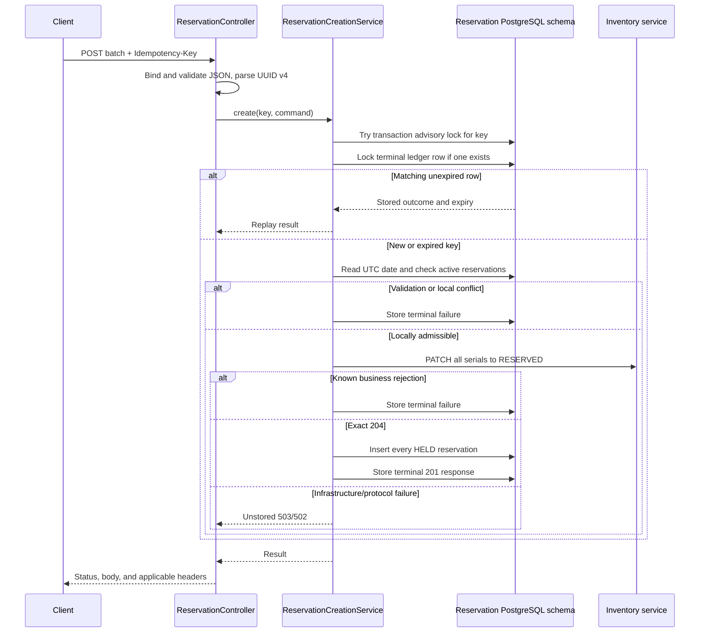

# Reservation creation walkthrough

This document describes the synchronous terminal-ledger implementation of
`POST /api/v1/reservations`.

## 1. The complete path



All creation work runs in the request thread. The only scheduled operation is removal of expired
terminal ledger rows.

## 2. Public request

The endpoint accepts common order data plus one to one hundred items:

```json
{
  "customerId": "CUSTOMER-001",
  "orderId": "ORDER-001",
  "items": [
    {
      "serialNumber": "DRILL-001",
      "startDate": "2026-10-01",
      "endDate": "2026-10-03"
    },
    {
      "serialNumber": "MIXER-001",
      "startDate": "2026-10-01",
      "endDate": "2026-10-01"
    }
  ]
}
```

`Idempotency-Key` is required and must contain one canonical UUID v4. The key identifies the
complete ordered request, not an individual item.

Spring and Jackson reject malformed JSON, unknown members, missing values, wrong scalar types,
invalid date syntax, null items, and item counts outside 1–100 before calling the service. These
framework failures do not create a ledger row because there is no canonical command to fingerprint.

`ReservationCreationValidation` checks command-level rules:

- duplicate serial numbers using case-sensitive equality;
- supported date years;
- `endDate >= startDate`;
- `startDate >=` the PostgreSQL UTC date.

Those failures do have a canonical command and are stored as terminal `400 VALIDATION_FAILED`
outcomes.

## 3. Controller and conversion

`ReservationController.create` performs three tasks:

1. Parses the header with `IdempotencyKeyParser`.
2. Converts `CreateReservationsRequest` into `ReservationCreationCommand`.
3. Converts `ReservationCreationService.Result` into the HTTP response.

The result already contains the status, response body, stable code, expiry, and replay flag. The
controller adds:

- `Idempotency-Replayed` and `Idempotency-Key-Expires-At` for stored outcomes;
- `Retry-After: 1` for `IDEMPOTENCY_IN_PROGRESS`;
- `application/json` for `201`;
- `application/problem+json` for errors.

Batch success has no `Location` header.

## 4. Fingerprint and execution lock

`IdempotencyFingerprint.of` hashes a versioned, length-prefixed representation of:

1. `customerId`;
2. `orderId`;
3. item count;
4. each serial number, start date, and end date in request order.

This makes JSON whitespace and property order irrelevant while keeping array order and string case
significant.

`IdempotencyFingerprint.lockId` separately hashes the UUID into a PostgreSQL advisory-lock ID.
The repository calls `pg_try_advisory_xact_lock`, which never waits:

- `true`: this transaction may process the key;
- `false`: another transaction is processing it, so return
  `409 IDEMPOTENCY_IN_PROGRESS`.

The advisory lock is scoped to the database transaction. PostgreSQL releases it automatically at
commit, rollback, connection loss, or process death. There is no owner token, lease, timeout,
takeover, or recovery job.

## 5. Terminal ledger lookup

After taking the advisory lock, the service loads the exact
`reservation_creation_requests` row with a pessimistic write lock.

For an unexpired row:

- a matching fingerprint returns the stored outcome with `replayed=true`;
- a different fingerprint returns `422 IDEMPOTENCY_KEY_REUSED` and leaves the row unchanged.

A matching replay performs no current-date validation, active-reservation query, Inventory call, or
reservation insert. It returns the response snapshot saved by the original transaction, including
the original generated IDs and timestamps.

An expired row is treated as a new key. The new attempt may use a different payload. If it reaches a
terminal outcome, the existing entity is overwritten with the new fingerprint, response, completion
time, and expiry.

## 6. PostgreSQL time

The repository supplies:

- `clock_timestamp()` for replay expiry and terminal completion;
- `(clock_timestamp() AT TIME ZONE 'UTC')::date` for creation-date validation.

The explicit UTC conversion makes the business date independent of the database session timezone.
`Reservation.created_at` also uses its PostgreSQL default, and Hibernate reads the generated value
after insert.

## 7. Local availability

Reservation queries once for every requested serial number where:

```text
status IN (HELD, CONFIRMED)
AND end_date >= current PostgreSQL UTC date
```

The requested date ranges do not need to overlap. A current or future active reservation means the
item is already promised and blocks another reservation. A future `startDate` still blocks.
`endDate == today` still blocks. A `CANCELLED` row or an active-status row ending before today
does not block.

If conflicts exist, the service builds one `failedItems` entry for every conflicting request item
in original order, stores `409 ACTIVE_RESERVATION_EXISTS`, and never calls Inventory.

There is no second local check after Inventory. Competing supported creation calls are serialized by
Inventory's locked `AVAILABLE -> RESERVED` transition: after one key commits, the other key is
rejected as unavailable.

## 8. Inventory call

`ReservationCreationService` sends the unchanged public idempotency key and a request-ordered list
of `{serialNumber, status: RESERVED}` changes through `InventoryGateway`.

`RestInventoryService` accepts only exact `204 No Content` as success. It validates known
Inventory Problem Details before converting them to domain results:

| Inventory response | Reservation outcome |
| --- | --- |
| `204` | Continue to local creation |
| `404 INVENTORY_ITEM_NOT_FOUND` | Stored `422 INVENTORY_ITEM_NOT_FOUND` |
| `409 INVALID_INVENTORY_STATUS_TRANSITION` | Stored `409 INVENTORY_ITEM_UNAVAILABLE` |
| `400 VALIDATION_FAILED` | Stored `400 INVALID_INVENTORY_REFERENCE` |
| `422 IDEMPOTENCY_KEY_REUSED` | Stored `422 IDEMPOTENCY_KEY_REUSED` |
| `409 IDEMPOTENCY_IN_PROGRESS` | Unstored `409 IDEMPOTENCY_IN_PROGRESS` |
| Exhausted connectivity/502/503/504 | Unstored `503 INVENTORY_SERVICE_UNAVAILABLE` |
| Unknown or malformed response | Unstored `502 INVENTORY_SERVICE_ERROR` |

Inventory owns serial-number syntax, existence, current status, row locking, and atomic status
transition. Reservation never reads Inventory tables.

## 9. Five foreground attempts

The HTTP adapter composes resilience as:

```text
CircuitBreaker(Retry(Inventory HTTP call))
```

Retry handles connection/resource access failures and HTTP 502, 503, and 504. There are five total
attempts. Before attempts two through five, nominal waits are:

```text
200 ms -> 400 ms -> 800 ms -> 1600 ms
```

Each wait has ±20-percent jitter. Connect timeout is 500 ms and read timeout is 1500 ms. Every
physical attempt uses the same key and body. HTTP 500, terminal 4xx results, and unexpected normal
responses are not retried.

The circuit breaker sees the complete retry sequence as one logical call. An open breaker prevents
the HTTP call and produces the same unstored `503` result.

## 10. Successful local commit

After Inventory returns exact success, the service:

1. Creates one `Reservation` per command item.
2. Calls `saveAllAndFlush`.
3. Reads every database-generated ID and timestamp.
4. Builds request-ordered immutable `ReservationSnapshot` values.
5. Creates the terminal `201` outcome.
6. Samples PostgreSQL completion time.
7. Saves and flushes the ledger row.
8. Commits the transaction.

The reservation rows and success ledger row share one local transaction. If reservation or ledger
persistence fails, both roll back. A later same-key request calls Inventory again; Inventory's
terminal ledger replays its earlier success, allowing Reservation to retry its local commit.

The Inventory transition remains a separate service transaction. This design does not make both
databases atomic and has no compensating release operation.

## 11. Stored outcomes

The replacement V2 migration creates this table:

| Column | Meaning |
| --- | --- |
| `idempotency_key` | UUID primary key |
| `fingerprint` | Lowercase 64-character SHA-256 |
| `http_status` | 201, 400, 409, or 422 |
| `outcome` | Complete JSON response snapshot |
| `recorded_at` | PostgreSQL terminal completion time |
| `expires_at` | Exactly seven days after completion |

The database checks that `outcome.status` equals `http_status`. The table has one expiry index.
It contains no request payload, accepted date, processing state, lease, attempt count, retry time,
recovery deadline, or reconciliation marker.

Stored outcomes are:

- successful `201`;
- command-level validation `400`;
- invalid Inventory reference `400`;
- active or unavailable conflict `409`;
- missing Inventory item or upstream key reuse `422`.

Busy, transport, circuit-open, and protocol errors are temporary or uncertain and are not stored.

## 12. Cleanup

`ReservationCreationCleanupScheduledService` starts daily at 03:00 UTC by default. It calls
`ReservationCreationCleanupService.deleteChunk`, where each chunk runs in a new transaction.

The repository deletes up to 1000 expired rows ordered by expiry and key with
`FOR UPDATE SKIP LOCKED`. The scheduler repeats full chunks until it reaches a smaller chunk or
the 60-second runtime budget. It then samples the expired backlog.

Cleanup deletes only terminal ledger rows. It never deletes reservation rows, calls Inventory,
replays outcomes, or starts creation.

## 13. Failure behavior

| Failure point | Reservation database | Next same-key request |
| --- | --- | --- |
| Invalid framework input | No ledger or reservation write | Valid request is treated as new |
| Stored validation/business rejection | Terminal ledger only | Replays rejection until expiry |
| Inventory busy | No ledger or reservation write | Executes again |
| Inventory unavailable after retries | No ledger or reservation write | Executes again |
| Inventory response malformed | No ledger or reservation write | Executes again |
| Process dies before local commit | Local transaction rolls back | Executes; Inventory may replay |
| Local insert or ledger write fails | Local transaction rolls back | Executes; Inventory may replay |
| Response is lost after local commit | Reservations and ledger remain | Replays exact stored response |

## 14. Deliberate limitations

The service holds one PostgreSQL transaction and connection during the bounded Inventory call. This
keeps concurrency and terminal persistence simple, but it means a slow Inventory request occupies a
database connection for the duration of its timeouts and retry waits.

Because only terminal outcomes are stored, an uncertain request has no remembered accepted date. If
Inventory committed just before midnight and Reservation received no usable response, a retry after
midnight revalidates against the new PostgreSQL UTC date. A start date that has just become
historical can therefore be rejected before Inventory replay is consulted. Persisting an in-progress
intent would solve that edge by reintroducing workflow state, which this design intentionally omits.

Inventory status still does not record reservation ownership and Reservation has no safe conditional
release operation. Cancellation and the wider rental lifecycle remain separate future work.

## 15. Main files

| File | Responsibility |
| --- | --- |
| `ReservationController` | HTTP request, response, and idempotency headers |
| `ReservationConverter` | DTO and domain-command conversion |
| `ReservationCreationService` | Synchronous transaction and orchestration |
| `ReservationCreationRequest` | Six-field terminal ledger entity |
| `ReservationCreationRequestRepository` | Advisory lock, row lock, database time, and cleanup SQL |
| `ReservationRepository` | Active lookup and reservation persistence |
| `ReservationCreationOutcome` | Stored response representation |
| `ReservationCreationOutcomes` | Stable outcome factories |
| `RestInventoryService` | Inventory protocol and Resilience4j |
| `ReservationCreationCleanupService` | Transactional cleanup chunks |
| `ReservationCreationCleanupScheduledService` | Daily bounded cleanup loop and cleanup metrics |
